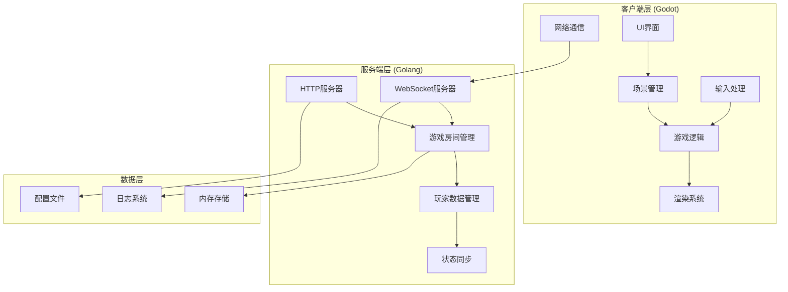

# 贪吃蛇游戏开发 - 设计与实现规范

## 项目概述

本项目是一个教学导向的贪吃蛇游戏开发实践，通过4个渐进式课时展示完整的游戏开发流程。项目采用Godot 4.4作为客户端引擎，Golang 1.22作为服务端技术栈，实现从单机游戏到多人对战的完整功能。

## 设计原则

### 1. 教学优先原则
- **渐进式复杂度**：每个课时在前一课时基础上增加新概念
- **概念清晰性**：每个技术点都有明确的教学目标
- **实践导向**：理论与实践紧密结合，边学边做

### 2. 技术选型原则
- **学习友好**：选择易于理解和上手的技术
- **工业标准**：使用主流的开发工具和框架
- **可扩展性**：架构支持功能的逐步扩展

### 3. 代码质量原则
- **可读性优先**：代码清晰易懂，注释充分
- **模块化设计**：功能模块独立，接口清晰
- **避免过度设计**：保持简洁，避免不必要的复杂性

## 技术架构规范

### 1. 整体架构


### 2. 客户端架构规范

#### 场景结构标准
```
Main.tscn (主场景)
├── UI (CanvasLayer)
│   ├── MainMenu (Control)
│   ├── GameUI (Control)
│   └── Settings (Control)
├── GameWorld (Node2D)
│   ├── Snake (Node2D)
│   ├── Food (Node2D)
│   ├── AI (Node2D)
│   └── Effects (Node2D)
└── Managers (Node)
    ├── GameManager (Node)
    ├── NetworkManager (Node)
    └── AudioManager (Node)
```

#### 脚本命名规范
- **类名**：PascalCase (如：GameManager, SnakeController)
- **文件名**：PascalCase.gd (如：GameManager.gd)
- **变量名**：snake_case (如：player_score, game_state)
- **常量名**：UPPER_CASE (如：MAX_SPEED, GRID_SIZE)
- **信号名**：snake_case (如：food_eaten, game_over)

#### 代码组织规范
```gdscript
# 文件头注释
## 类功能描述
## 作者：课程示例
## 创建时间：2025-01-16

extends Node2D
class_name ClassName

# 信号定义
signal signal_name(parameter)

# 枚举定义
enum StateType { IDLE, MOVING, DEAD }

# 常量定义
const MAX_SPEED: float = 300.0
const GRID_SIZE: int = 20

# 导出变量
@export var speed: float = 100.0
@export var grid_size: int = 20

# 公共变量
var current_state: StateType = StateType.IDLE
var player_score: int = 0

# 私有变量
var _internal_timer: float = 0.0

# 生命周期函数
func _ready() -> void:
    pass

func _process(delta: float) -> void:
    pass

# 公共方法
func public_method() -> void:
    pass

# 私有方法
func _private_method() -> void:
    pass

# 信号处理方法
func _on_signal_received() -> void:
    pass
```

### 3. 服务端架构规范

#### 项目结构标准
```
server/
├── main.go                 # 程序入口
├── go.mod                  # 依赖管理
├── config/                 # 配置管理
│   ├── config.go
│   └── config.yaml
├── handlers/               # 请求处理
│   ├── websocket.go
│   ├── api.go
│   └── middleware.go
├── models/                 # 数据模型
│   ├── player.go
│   ├── room.go
│   ├── game.go
│   └── message.go
├── services/               # 业务逻辑
│   ├── game_service.go
│   ├── room_service.go
│   └── player_service.go
├── utils/                  # 工具函数
│   ├── logger.go
│   ├── validator.go
│   └── helper.go
└── static/                 # 静态资源
    └── index.html
```

#### Go代码规范
```go
// 包注释
// Package main 贪吃蛇游戏服务器
// 提供WebSocket实时通信和游戏房间管理功能
package main

import (
    "context"
    "log"
    "net/http"
    "time"
)

// 常量定义
const (
    MaxPlayers     = 4
    HeartbeatTime  = 30 * time.Second
    GameTickRate   = 60 // FPS
)

// 类型定义
type GameState int

const (
    GameStateWaiting GameState = iota
    GameStatePlaying
    GameStatePaused
    GameStateFinished
)

// 结构体定义
type Player struct {
    ID       string    `json:"id"`
    Name     string    `json:"name"`
    Score    int       `json:"score"`
    Position Position  `json:"position"`
    IsAlive  bool      `json:"is_alive"`
}

// 方法定义
func (p *Player) Move(direction Direction) error {
    // 实现移动逻辑
    return nil
}

// 接口定义
type GameService interface {
    CreateRoom(ctx context.Context, playerID string) (*Room, error)
    JoinRoom(ctx context.Context, roomID, playerID string) error
    StartGame(ctx context.Context, roomID string) error
}
```

## 数据结构设计规范

### 1. 游戏核心数据结构

#### 蛇的表示
```gdscript
# Godot客户端
class_name Snake
extends Node2D

var body: Array[Vector2] = []           # 蛇身位置数组
var direction: Vector2 = Vector2.RIGHT  # 当前移动方向
var next_direction: Vector2 = Vector2.RIGHT  # 下一步方向
var is_growing: bool = false            # 是否正在增长
var move_speed: float = 5.0             # 移动速度(格/秒)
```

```go
// Golang服务端
type Snake struct {
    PlayerID  string    `json:"player_id"`
    Body      []Position `json:"body"`
    Direction Direction `json:"direction"`
    IsGrowing bool      `json:"is_growing"`
    IsAlive   bool      `json:"is_alive"`
}

type Position struct {
    X int `json:"x"`
    Y int `json:"y"`
}

type Direction struct {
    X int `json:"x"`
    Y int `json:"y"`
}
```

#### 游戏状态管理
```gdscript
# Godot客户端
class_name GameState
extends Resource

enum State { MENU, PLAYING, PAUSED, GAME_OVER }

@export var current_state: State = State.MENU
@export var score: int = 0
@export var level: int = 1
@export var high_score: int = 0
@export var game_speed: float = 1.0
```

```go
// Golang服务端
type GameRoom struct {
    ID          string              `json:"id"`
    Players     map[string]*Player  `json:"players"`
    GameState   GameState          `json:"game_state"`
    Foods       []Position         `json:"foods"`
    GridWidth   int                `json:"grid_width"`
    GridHeight  int                `json:"grid_height"`
    CreatedAt   time.Time          `json:"created_at"`
    UpdatedAt   time.Time          `json:"updated_at"`
}
```

### 2. 网络通信协议

#### 消息格式标准
```json
{
    "type": "message_type",
    "data": {
        // 具体数据内容
    },
    "timestamp": 1642345678,
    "sequence": 12345
}
```

#### 消息类型定义
```go
const (
    // 连接管理
    MsgTypeJoin     = "join"
    MsgTypeLeave    = "leave"
    MsgTypePing     = "ping"
    MsgTypePong     = "pong"
    
    // 房间操作
    MsgTypeCreateRoom = "create_room"
    MsgTypeJoinRoom   = "join_room"
    MsgTypeLeaveRoom  = "leave_room"
    MsgTypeRoomList   = "room_list"
    
    // 游戏控制
    MsgTypeStartGame   = "start_game"
    MsgTypePlayerInput = "player_input"
    MsgTypePauseGame   = "pause_game"
    MsgTypeEndGame     = "end_game"
    
    // 状态同步
    MsgTypeGameState    = "game_state"
    MsgTypePlayerUpdate = "player_update"
    MsgTypeGameOver     = "game_over"
)
```

## 美术资源规范

### 1. 视觉设计系统

#### 色彩规范
```gdscript
# 颜色常量定义
class_name GameColors
extends Resource

# 主色调
const PRIMARY_GREEN = Color(0.153, 0.682, 0.376)      # #27AE60
const PRIMARY_DARK = Color(0.173, 0.243, 0.314)       # #2C3E50

# 辅助色
const ACCENT_RED = Color(0.906, 0.298, 0.235)         # #E74C3C
const ACCENT_BLUE = Color(0.204, 0.596, 0.859)        # #3498DB

# 中性色
const WHITE = Color(1.0, 1.0, 1.0)                    # #FFFFFF
const LIGHT_GRAY = Color(0.741, 0.765, 0.780)         # #BDC3C7
const DARK_GRAY = Color(0.584, 0.647, 0.651)          # #95A5A6
```

#### 尺寸规范
```gdscript
# 尺寸常量定义
class_name GameSizes
extends Resource

# 网格系统
const GRID_SIZE = 20                    # 基础网格大小
const GAME_WIDTH = 800                  # 游戏区域宽度
const GAME_HEIGHT = 600                 # 游戏区域高度

# 游戏元素
const SNAKE_SEGMENT_SIZE = 18           # 蛇身段大小
const FOOD_SIZE = 16                    # 食物大小
const BORDER_WIDTH = 2                  # 边框宽度

# UI元素
const BUTTON_HEIGHT = 40                # 按钮高度
const FONT_SIZE_LARGE = 24              # 大字体
const FONT_SIZE_MEDIUM = 18             # 中字体
const FONT_SIZE_SMALL = 14              # 小字体
```

### 2. 程序化美术实现

#### 蛇身渲染
```gdscript
func create_snake_segment(position: Vector2, is_head: bool = false) -> Node2D:
    var segment = Node2D.new()
    
    if is_head:
        # 创建三角形头部
        var head = Polygon2D.new()
        var points = PackedVector2Array([
            Vector2(0, -SNAKE_SEGMENT_SIZE/2),
            Vector2(SNAKE_SEGMENT_SIZE, 0),
            Vector2(0, SNAKE_SEGMENT_SIZE/2)
        ])
        head.polygon = points
        head.color = GameColors.PRIMARY_GREEN
        segment.add_child(head)
    else:
        # 创建方形身体
        var body = ColorRect.new()
        body.size = Vector2(SNAKE_SEGMENT_SIZE, SNAKE_SEGMENT_SIZE)
        body.color = GameColors.PRIMARY_GREEN.lerp(GameColors.PRIMARY_DARK, 0.3)
        body.position = Vector2(-SNAKE_SEGMENT_SIZE/2, -SNAKE_SEGMENT_SIZE/2)
        segment.add_child(body)
    
    segment.position = position
    return segment
```

## 性能优化规范

### 1. 客户端优化

#### 对象池管理
```gdscript
class_name ObjectPool
extends Node

var _snake_segments: Array[Node2D] = []
var _food_objects: Array[Node2D] = []

func get_snake_segment() -> Node2D:
    if _snake_segments.is_empty():
        return create_snake_segment()
    return _snake_segments.pop_back()

func return_snake_segment(segment: Node2D) -> void:
    segment.visible = false
    _snake_segments.push_back(segment)
```

#### 渲染优化
- 使用CanvasLayer分层渲染
- 限制同屏粒子效果数量
- 合理使用Viewport和Camera2D

### 2. 服务端优化

#### 内存管理
```go
type GameServer struct {
    rooms       sync.Map
    playerPool  sync.Pool
    messagePool sync.Pool
}

func (s *GameServer) getPlayer() *Player {
    if p := s.playerPool.Get(); p != nil {
        return p.(*Player)
    }
    return &Player{}
}

func (s *GameServer) putPlayer(p *Player) {
    p.Reset()
    s.playerPool.Put(p)
}
```

#### 并发控制
- 使用sync.RWMutex保护共享数据
- 合理使用goroutine处理并发请求
- 实现优雅的服务器关闭

## 测试规范

### 1. 单元测试

#### Godot测试
```gdscript
# test_snake.gd
extends GutTest

func test_snake_movement():
    var snake = Snake.new()
    snake.add_segment(Vector2(0, 0))
    snake.move(Vector2.RIGHT)
    assert_eq(snake.get_head_position(), Vector2(1, 0))

func test_collision_detection():
    var snake = Snake.new()
    # 测试碰撞检测逻辑
    pass
```

#### Go测试
```go
// game_test.go
package main

import (
    "testing"
    "github.com/stretchr/testify/assert"
)

func TestSnakeMovement(t *testing.T) {
    snake := NewSnake(Position{X: 0, Y: 0})
    snake.Move(Direction{X: 1, Y: 0})
    
    expected := Position{X: 1, Y: 0}
    assert.Equal(t, expected, snake.GetHeadPosition())
}

func TestCollisionDetection(t *testing.T) {
    // 测试碰撞检测逻辑
}
```

### 2. 集成测试

#### 网络通信测试
```go
func TestWebSocketConnection(t *testing.T) {
    server := NewTestServer()
    defer server.Close()
    
    client := NewTestClient()
    err := client.Connect(server.URL)
    assert.NoError(t, err)
    
    // 测试消息发送和接收
}
```

## 部署规范

### 1. 客户端打包

#### 导出设置
```ini
[preset.0]
name="Windows Desktop"
platform="Windows Desktop"
runnable=true
custom_features=""
export_filter="all_resources"
include_filter=""
exclude_filter=""
export_path="builds/windows/snake_game.exe"
```

### 2. 服务端部署

#### Docker配置
```dockerfile
FROM golang:1.22-alpine AS builder

WORKDIR /app
COPY go.mod go.sum ./
RUN go mod download

COPY . .
RUN go build -o snake-server main.go

FROM alpine:latest
RUN apk --no-cache add ca-certificates
WORKDIR /root/

COPY --from=builder /app/snake-server .
COPY --from=builder /app/static ./static

EXPOSE 8080
CMD ["./snake-server"]
```

## 文档规范

### 1. 代码注释
- 每个类和重要方法都要有注释
- 复杂算法要有详细说明
- 使用统一的注释格式

### 2. API文档
- 使用标准格式描述接口
- 提供请求和响应示例
- 说明错误码和处理方式

### 3. 用户文档
- 安装和使用说明
- 常见问题解答
- 故障排除指南

## 版本控制规范

### 1. Git工作流
- 使用feature分支开发新功能
- 主分支保持稳定可发布状态
- 提交信息使用统一格式

### 2. 版本号规范
- 使用语义化版本号 (Semantic Versioning)
- 格式：MAJOR.MINOR.PATCH
- 示例：1.0.0, 1.1.0, 1.1.1

## 总结

本规范文档为贪吃蛇游戏开发项目提供了全面的技术指导，涵盖了架构设计、编码规范、性能优化、测试部署等各个方面。遵循这些规范可以确保：

1. **代码质量**：统一的编码风格和最佳实践
2. **项目可维护性**：清晰的架构和文档
3. **团队协作效率**：标准化的开发流程
4. **教学效果**：渐进式的学习曲线

在后续的代码实现过程中，应严格按照本规范执行，确保项目的高质量交付和良好的教学效果。