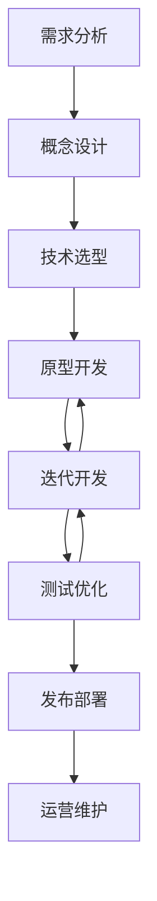
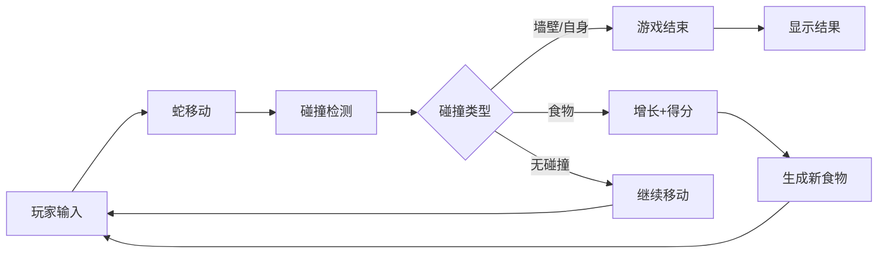
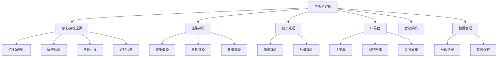
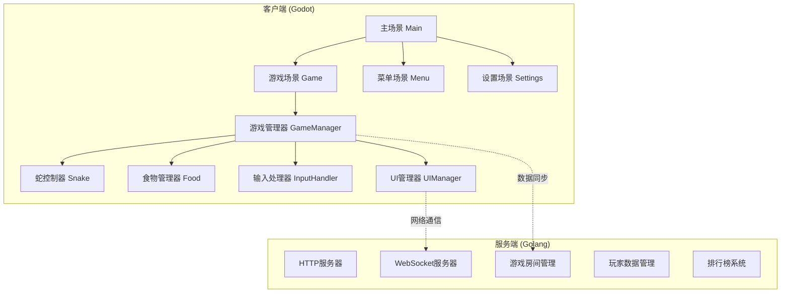
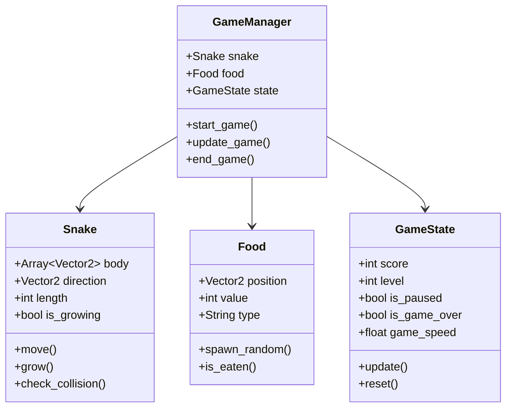
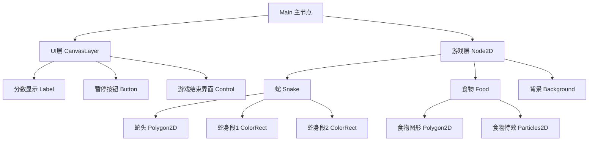
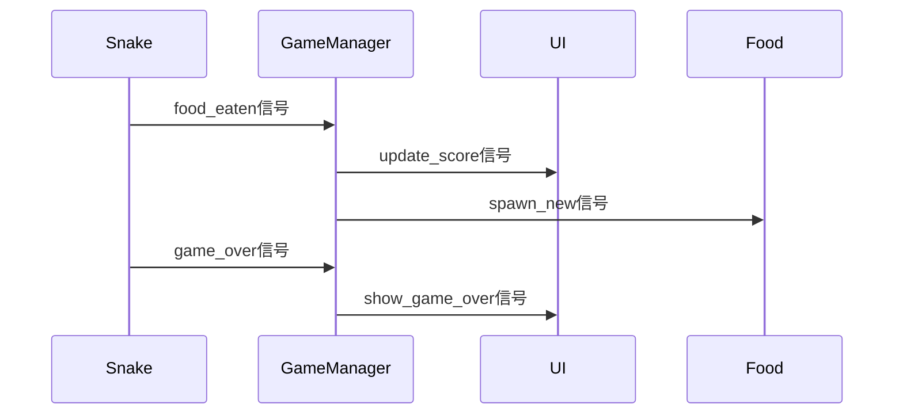

# 课时1：游戏设计与项目规划

## 课时目标
- 理解游戏开发的完整流程
- 掌握项目规划和架构设计方法
- 学会使用Godot引擎的基础概念
- 完成贪吃蛇游戏的整体设计

## 教学内容

### 1. 游戏开发流程介绍（8分钟）

#### 现代游戏开发流程


#### 敏捷开发在游戏项目中的应用
- **迭代周期**：1-2周为一个Sprint
- **可玩原型**：每个迭代都要有可测试的版本
- **持续反馈**：及时调整设计和实现
- **版本控制**：Git工作流的重要性

### 2. 贪吃蛇游戏设计（12分钟）

#### 游戏核心循环分析


#### 功能模块划分


#### 技术架构设计


#### 数据结构设计


### 3. Godot引擎介绍（10分钟）

#### 节点树概念


#### GDScript语言特点
- **Python风格语法**：缩进敏感，易于阅读
- **动态类型**：灵活的变量声明
- **信号系统**：事件驱动编程
- **节点访问**：便捷的场景树操作

#### 信号系统（观察者模式）


## 实践环节

### 1. 创建项目结构
```
snake-game/
├── project.godot
├── scenes/
│   ├── Main.tscn
│   ├── Game.tscn
│   ├── Menu.tscn
│   └── GameOver.tscn
├── scripts/
│   ├── GameManager.gd
│   ├── Snake.gd
│   ├── Food.gd
│   └── InputHandler.gd
├── assets/
│   └── fonts/
└── docs/
    ├── design.md
    └── api.md
```

### 2. 设计游戏界面原型
- **主菜单界面**：开始游戏、设置、退出
- **游戏界面**：游戏区域、分数显示、暂停按钮
- **游戏结束界面**：最终分数、重新开始、返回菜单

### 3. 编写技术设计文档
- **游戏设计文档**：玩法规则、功能需求
- **技术架构文档**：模块划分、接口设计
- **开发计划**：任务分解、时间安排

## 课时总结

本课时通过系统性的设计方法，让学生理解：
1. 游戏开发不仅仅是编程，更是系统工程
2. 良好的设计是成功项目的基础
3. 模块化思维在复杂项目中的重要性
4. 文档驱动开发的价值

## 作业布置

1. 完善游戏设计文档，添加更多细节
2. 研究Godot官方文档中的2D游戏示例
3. 思考如何为贪吃蛇游戏添加创新元素

## 下节课预告

下节课我们将开始实际的编码工作，实现贪吃蛇的核心游戏逻辑，包括蛇的移动、食物生成和碰撞检测。