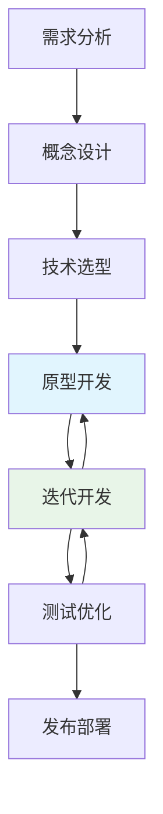
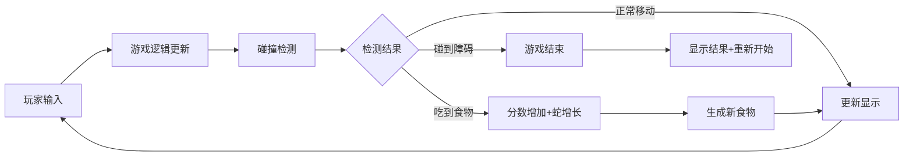
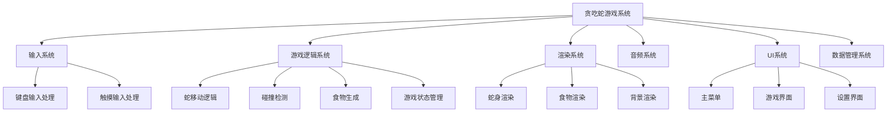
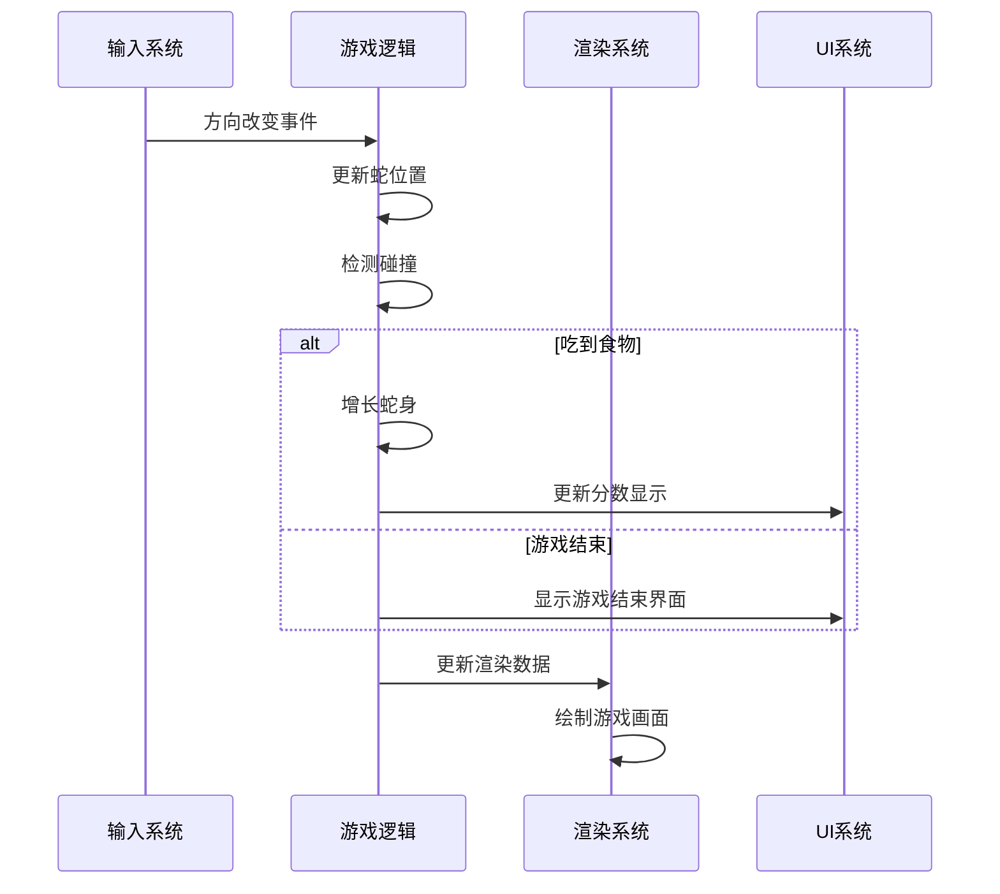
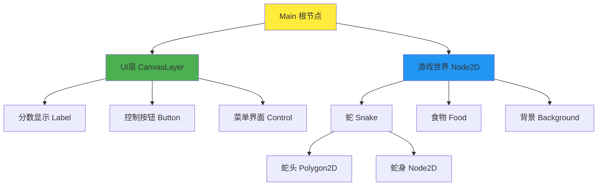
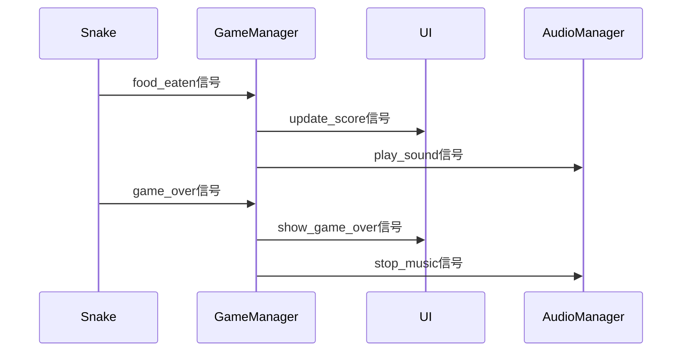

# 课时1：游戏设计与项目规划

## 课时目标（5分钟）
通过本课时学习，学生将能够：
- 理解现代游戏开发的完整流程和方法论
- 掌握游戏项目的需求分析和架构设计思路
- 了解Godot引擎的核心概念和开发模式
- 建立系统性的游戏开发思维框架

## 教学内容

### 1. 游戏开发流程与方法论（8分钟）

#### 为什么需要系统化的开发流程？
现代游戏开发已经从个人作坊式开发演变为工程化的团队协作。一个成功的游戏项目需要：
- **明确的目标和范围**：避免功能蔓延和开发失控
- **合理的技术架构**：支持功能扩展和团队协作
- **可控的开发节奏**：按时交付和质量保证

#### 敏捷开发在游戏项目中的应用


**关键原则**：
- **短迭代周期**：1-2周一个Sprint，快速验证想法
- **可玩原型优先**：每个迭代都要有可测试的版本
- **持续反馈**：及时调整设计和实现方向
- **版本控制**：Git工作流保证代码安全和协作效率

#### 从想法到产品的转化过程
1. **需求分析**：明确游戏类型、目标用户、核心玩法
2. **概念设计**：游戏规则、美术风格、技术需求
3. **技术选型**：引擎选择、开发语言、架构设计
4. **原型验证**：核心玩法的快速实现和测试
5. **迭代完善**：功能扩展、性能优化、用户体验改进

### 2. 贪吃蛇游戏的系统分析（12分钟）

#### 为什么选择贪吃蛇作为教学案例？
- **规则简单明确**：易于理解，专注技术学习
- **技术覆盖全面**：涉及渲染、逻辑、AI、网络等各个方面
- **扩展性强**：可以逐步增加复杂功能
- **经典且实用**：许多现代游戏的基础概念都能在其中体现

#### 游戏核心循环分析


**核心概念解析**：
- **游戏循环（Game Loop）**：输入→更新→渲染的循环过程
- **状态管理**：游戏不同阶段的状态转换
- **事件驱动**：基于用户输入和游戏事件的响应机制

#### 系统模块化设计思路


**设计原则**：
- **单一职责**：每个模块只负责一个明确的功能
- **低耦合**：模块间依赖关系简单清晰
- **高内聚**：模块内部功能紧密相关
- **可扩展**：支持新功能的添加而不影响现有代码

#### 数据流和控制流设计


### 3. Godot引擎核心概念（10分钟）

#### 为什么选择Godot？
- **开源免费**：无版权限制，适合教学和个人开发
- **轻量级**：安装简单，启动快速，资源占用少
- **一体化开发环境**：编辑器、脚本、调试集成
- **优秀的2D支持**：专门优化的2D渲染管线
- **跨平台发布**：一次开发，多平台部署

#### 节点树系统的设计哲学


**核心概念**：
- **场景（Scene）**：可重用的节点树，类似于预制件
- **节点（Node）**：功能的基本单元，具有特定的能力
- **继承关系**：子节点继承父节点的变换和属性
- **信号系统**：节点间的事件通信机制

#### GDScript语言特点
```gdscript
# Python风格的语法，易于学习
extends Node2D
class_name Snake

# 信号定义 - 事件驱动编程
signal food_eaten(score)
signal game_over

# 变量声明 - 动态类型
var body: Array[Vector2] = []
var direction: Vector2 = Vector2.RIGHT

# 函数定义 - 简洁明了
func move() -> void:
    # 移动逻辑
    pass

# 信号连接 - 观察者模式
func _ready():
    food_eaten.connect(_on_food_eaten)
```

#### 信号系统的威力


**优势**：
- **解耦合**：发送者不需要知道接收者的具体实现
- **一对多**：一个信号可以连接多个处理函数
- **灵活性**：可以在运行时动态连接和断开信号

## 实践环节（5分钟）

### 课堂练习：项目结构设计
学生分组讨论并设计贪吃蛇游戏的项目结构：

1. **场景组织**：需要哪些场景文件？
2. **脚本划分**：如何分配代码职责？
3. **资源管理**：美术和音频资源如何组织？
4. **配置文件**：游戏设置如何存储？

### 思考题
1. 如果要添加多人对战功能，现有的架构需要如何调整？
2. 如何设计一个可扩展的关卡系统？
3. 什么样的数据结构最适合表示蛇的身体？

## 课时总结（2分钟）

通过本课时的学习，我们建立了游戏开发的系统性思维：

1. **工程化思维**：游戏开发是系统工程，需要规划和设计
2. **模块化设计**：复杂系统通过模块分解来管理复杂度
3. **工具理解**：Godot引擎的设计哲学和核心概念
4. **实践导向**：理论学习要与实际项目结合

**关键收获**：
- 游戏开发流程的重要性
- 系统分析和模块化设计方法
- Godot引擎的核心优势和概念
- 为后续编码实践奠定理论基础

## 课后思考

1. 研究一款你喜欢的游戏，分析它可能的模块划分
2. 尝试用Godot创建一个简单的"Hello World"项目
3. 思考贪吃蛇游戏还可以添加哪些有趣的功能

## 下节课预告

下节课我们将进入实际的编码环节，学习如何在Godot中实现贪吃蛇的核心游戏逻辑，包括蛇的移动、食物生成和碰撞检测。我们将把今天学到的设计理念转化为可运行的代码。