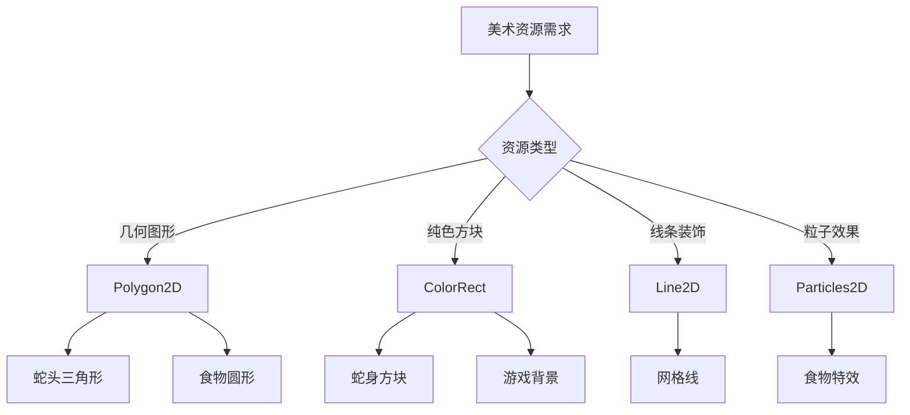
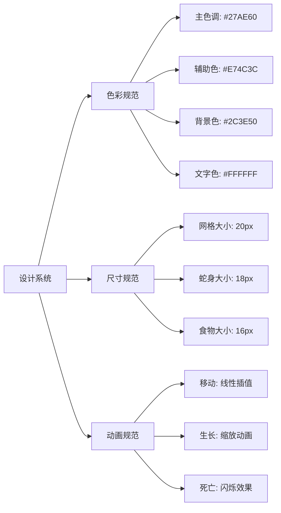
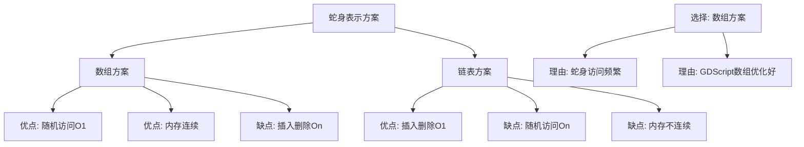
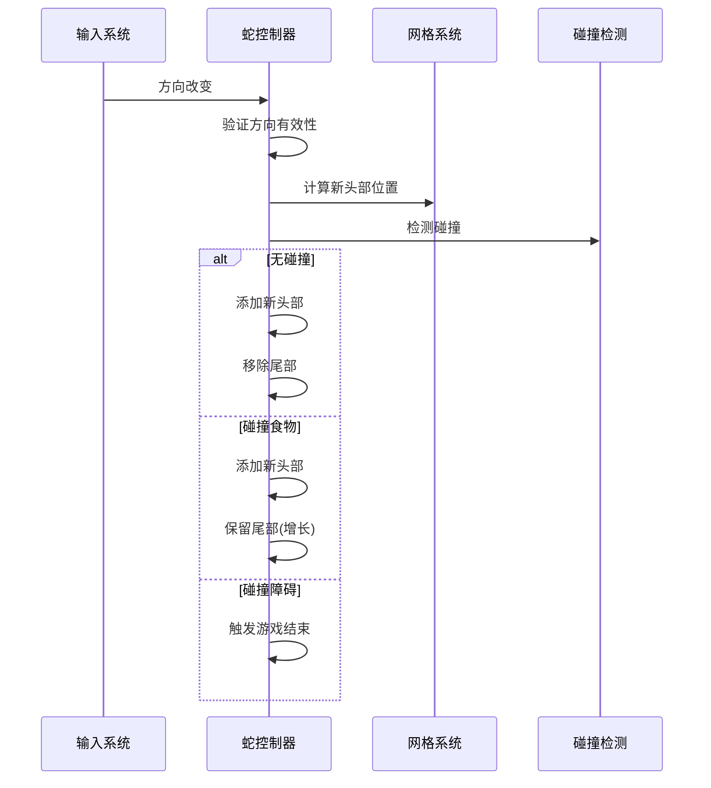
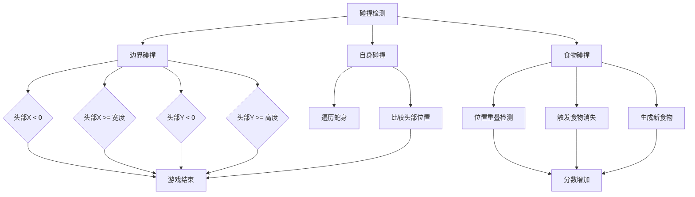
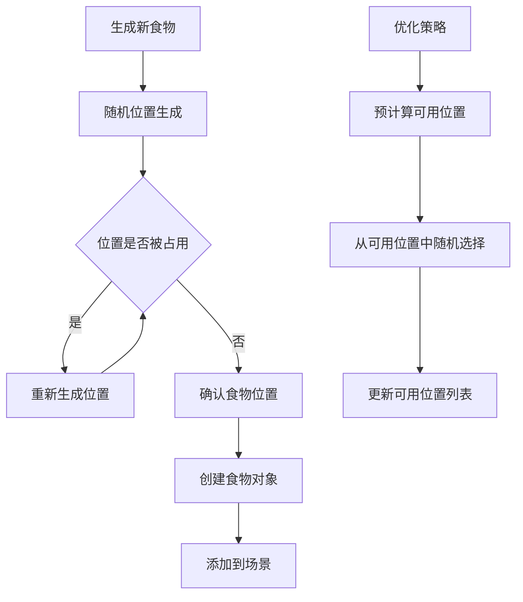
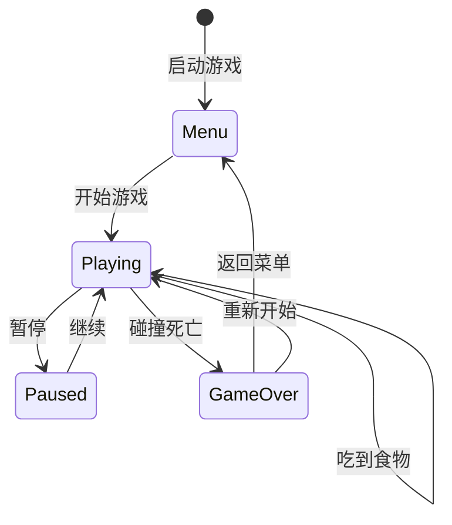
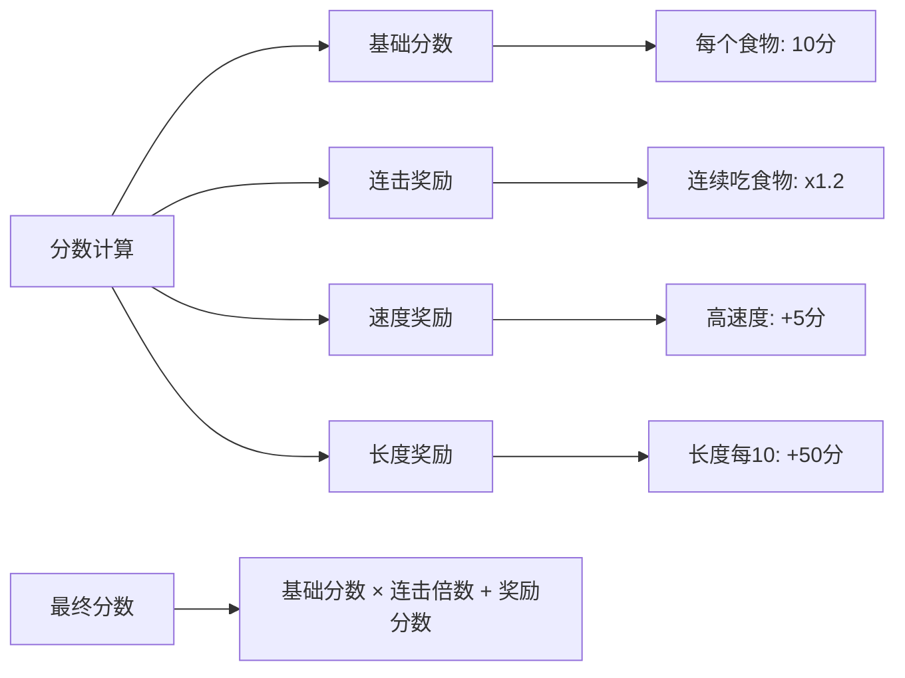
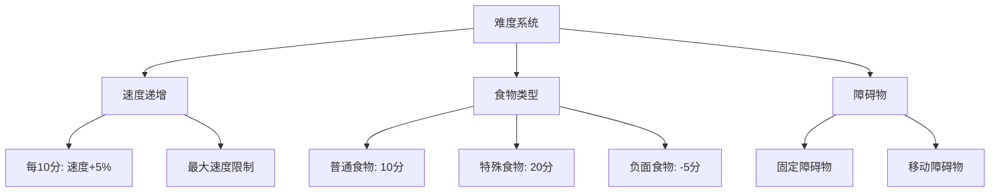

# 课时2：核心游戏逻辑实现

## 课时目标
- 掌握Godot场景搭建和节点使用
- 学会程序化美术资源创建
- 实现贪吃蛇的核心移动逻辑
- 完成碰撞检测和游戏状态管理

## 教学内容

### 1. 场景搭建与美术资源（8分钟）

#### Godot自绘技术方案


#### 视觉设计系统


#### 响应式布局设计

```mermaid
graph TB
    A[游戏界面 1024x768] --> B[游戏区域 800x600]
    A --> C[UI区域 224x768]
    
    B --> B1[网格 40x30]
    B --> B2[边界检测区域]
    
    C --> C1[分数显示]
    C --> C2[控制按钮]
    C --> C3[游戏信息]
    
    style A fill:#2C3E50
    style B fill:#34495E
    style C fill:#95A5A6
```


### 2. 游戏核心逻辑（15分钟）

#### 蛇的数据结构对比


#### 移动算法流程


#### 碰撞检测系统


#### 食物生成算法


### 3. 状态管理（7分钟）

#### 游戏状态机


#### 分数系统设计


#### 难度递增机制


## 实践环节

### 1. 场景节点结构
```
Main (Node2D)
├── Background (ColorRect)
├── GameArea (Node2D)
│   ├── Snake (Node2D)
│   │   ├── Head (Polygon2D)
│   │   └── Body (Node2D)
│   │       ├── Segment1 (ColorRect)
│   │       ├── Segment2 (ColorRect)
│   │       └── ...
│   ├── Food (Node2D)
│   │   ├── Shape (Polygon2D)
│   │   └── Effect (Particles2D)
│   └── Grid (Node2D)
└── UI (CanvasLayer)
    ├── Score (Label)
    ├── Level (Label)
    └── Controls (VBoxContainer)
```

### 2. 核心脚本结构

#### Snake.gd 核心逻辑
```gdscript
# 主要属性
var body: Array[Vector2] = []
var direction: Vector2 = Vector2.RIGHT
var grid_size: int = 20
var is_growing: bool = false

# 主要方法
func move() -> void
func grow() -> void
func check_collision() -> CollisionType
func change_direction(new_direction: Vector2) -> void
```

#### GameManager.gd 游戏管理
```gdscript
# 游戏状态
enum GameState { MENU, PLAYING, PAUSED, GAME_OVER }
var current_state: GameState = GameState.MENU

# 游戏数据
var score: int = 0
var level: int = 1
var game_speed: float = 1.0

# 主要方法
func start_game() -> void
func update_game(delta: float) -> void
func end_game() -> void
```

### 3. 实现步骤

1. **创建基础场景结构**
   - 设置游戏区域和UI布局
   - 创建网格背景
   - 配置摄像机和视口

2. **实现蛇的移动逻辑**
   - 初始化蛇身数组
   - 实现移动算法
   - 添加方向控制

3. **添加碰撞检测**
   - 边界检测
   - 自身碰撞检测
   - 食物碰撞检测

4. **完成食物系统**
   - 随机生成食物
   - 食物消失逻辑
   - 分数计算

## 技术要点

### 1. 性能优化
- 使用对象池管理蛇身段
- 限制碰撞检测频率
- 优化渲染调用

### 2. 代码规范
- 统一命名约定
- 适当的注释
- 模块化设计

### 3. 调试技巧
- 使用print()输出调试信息
- 利用Godot调试器
- 可视化碰撞区域

## 课时总结

本课时通过实际编码，学生掌握了：
1. Godot场景系统的使用方法
2. 游戏循环和状态管理
3. 碰撞检测的实现原理
4. 程序化美术资源创建

## 作业布置

1. 优化蛇的移动动画效果
2. 添加更多类型的食物
3. 实现简单的粒子效果

## 下节课预告

下节课我们将实现游戏AI系统，让电脑也能玩贪吃蛇，并学习基础的AI算法在游戏中的应用。