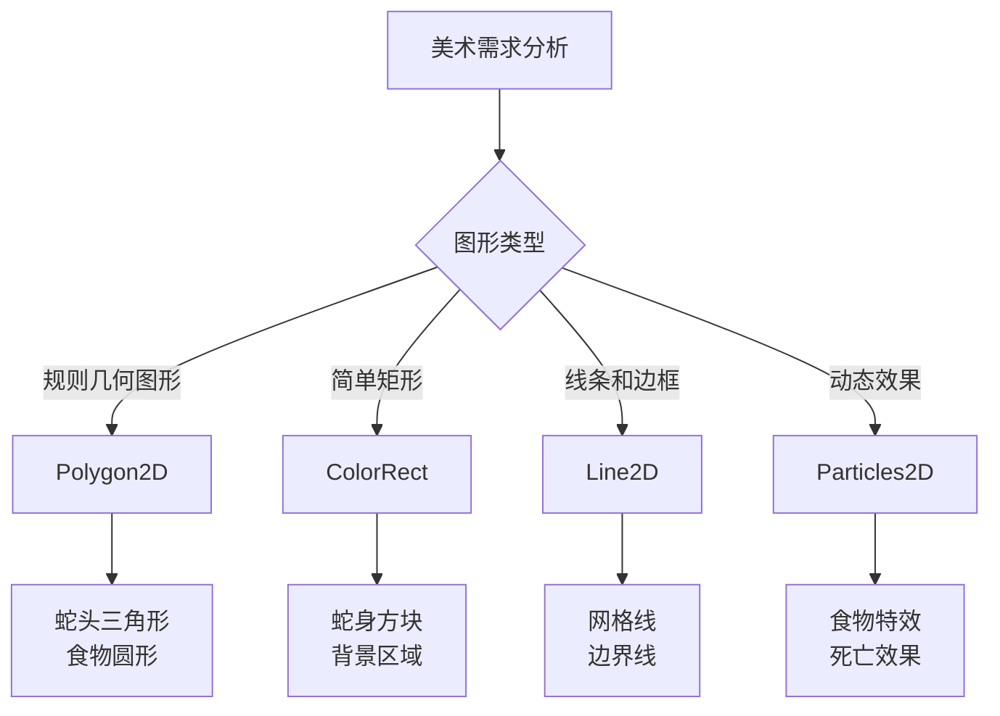
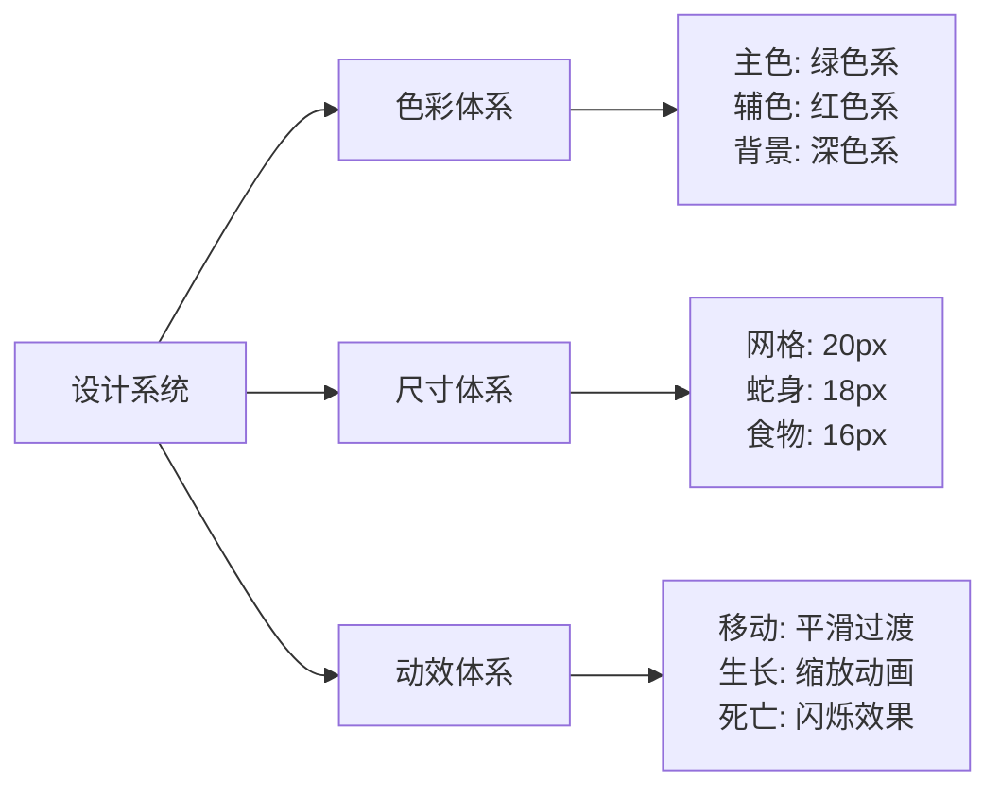
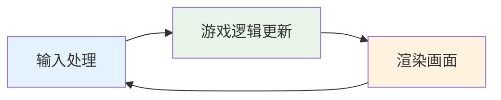
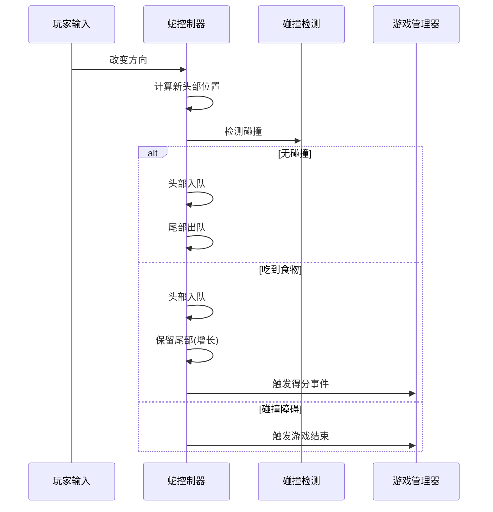
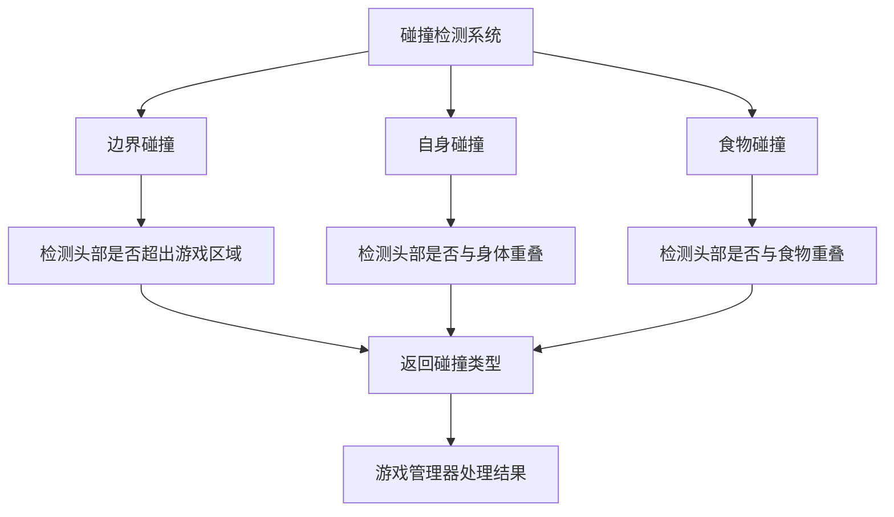
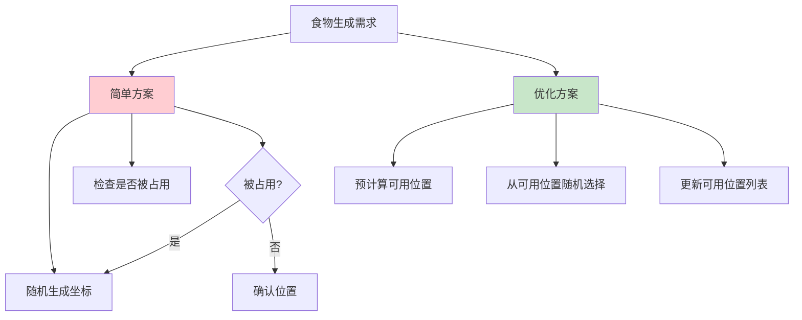
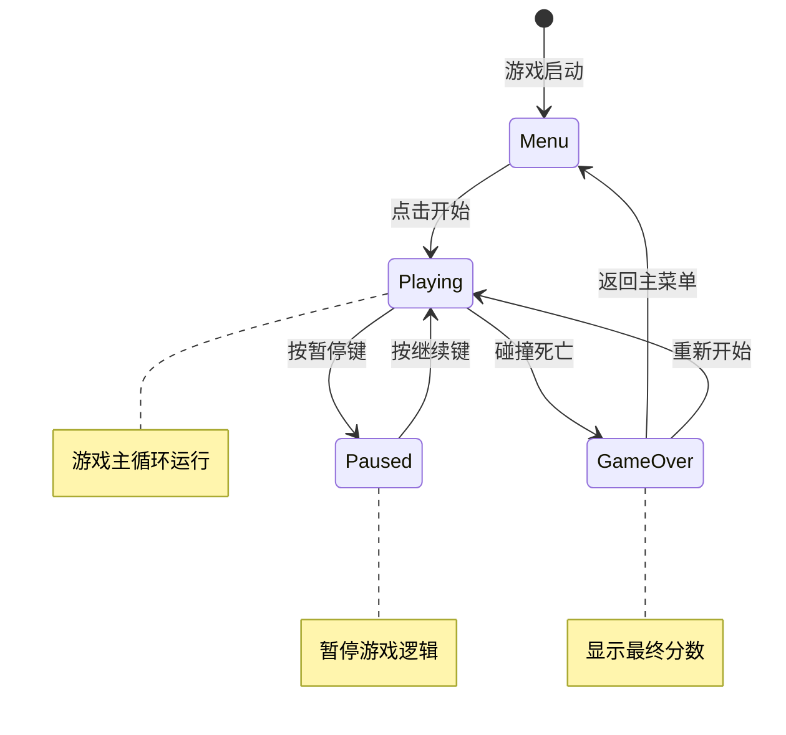
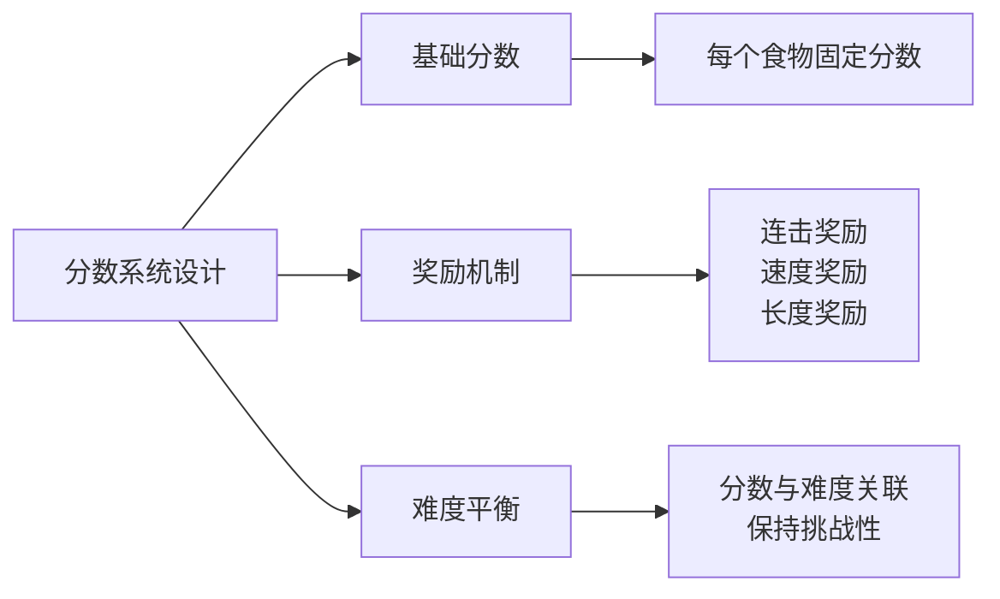

# 课时2：核心游戏逻辑实现

## 课时目标（5分钟）
通过本课时学习，学生将能够：
- 掌握Godot场景搭建和节点系统的实际应用
- 理解游戏循环和状态管理的核心概念
- 实现贪吃蛇的移动逻辑和碰撞检测
- 学会程序化创建美术资源的方法

## 教学内容

### 1. 从设计到实现：场景搭建（8分钟）

#### 程序化美术的优势
在没有专业美术资源的情况下，程序化生成美术内容有以下优势：
- **完全可控**：颜色、尺寸、形状都可以通过代码精确控制
- **动态调整**：可以根据游戏状态实时改变外观
- **性能友好**：简单的几何图形渲染效率高
- **学习价值**：理解图形渲染的基本原理

#### Godot节点选择策略


**节点选择原则**：
- **功能匹配**：选择最适合需求的节点类型
- **性能考虑**：简单节点优于复杂节点
- **扩展性**：考虑后续功能扩展的需要

#### 视觉设计系统的建立


**设计原则**：
- **一致性**：统一的视觉风格
- **对比度**：确保元素清晰可辨
- **简洁性**：避免视觉干扰
- **可扩展性**：支持新元素的加入

### 2. 游戏核心逻辑的实现（15分钟）

#### 理解游戏循环（Game Loop）
游戏循环是所有游戏的核心概念：


**每一帧的处理流程**：
1. **输入处理**：检测玩家的键盘输入
2. **逻辑更新**：更新游戏状态（蛇的位置、碰撞检测等）
3. **渲染画面**：将新的游戏状态绘制到屏幕上

#### 数据结构的选择与权衡
对于蛇身的表示，我们需要考虑不同数据结构的特点：

```mermaid
graph TB
    A[蛇身数据结构选择] --> B[数组 Array]
    A --> C[链表 LinkedList]
    
    B --> B1[✓ 随机访问 O(1)]
    B --> B2[✓ 内存连续，缓存友好]
    B --> B3[✗ 插入删除 O(n)]
    
    C --> C1[✓ 插入删除 O(1)]
    C --> C2[✗ 随机访问 O(n)]
    C --> C3[✗ 内存不连续]
    
    D[最终选择: Array] --> E[理由1: 蛇身访问频繁]
    D --> F[理由2: GDScript数组优化]
    D --> G[理由3: 代码简洁易懂]
```

**决策依据**：
- 贪吃蛇游戏中，我们经常需要访问蛇头和蛇尾
- 蛇身长度通常不会太长，插入删除的性能影响有限
- 数组的代码更直观，便于教学和调试

#### 移动算法的核心思想
蛇的移动本质上是一个"队列"操作：


**关键概念**：
- **头部入队**：在数组开头添加新位置
- **尾部出队**：移除数组末尾位置
- **条件保留**：吃到食物时不移除尾部

#### 碰撞检测的分层设计


**设计要点**：
- **分离关注点**：不同类型的碰撞分别处理
- **返回类型**：使用枚举明确碰撞结果
- **性能优化**：按概率排序检测顺序

#### 食物生成的算法优化
简单的随机生成可能会产生性能问题：


**优化思路**：
- **预计算**：维护可用位置列表
- **增量更新**：蛇移动时更新可用位置
- **权衡取舍**：内存换时间的经典案例

### 3. 状态管理与游戏流程（7分钟）

#### 游戏状态机的设计
状态机是管理复杂游戏流程的有效工具：


**状态机的优势**：
- **清晰的流程控制**：每个状态的职责明确
- **易于扩展**：添加新状态不影响现有逻辑
- **调试友好**：状态转换容易跟踪和调试

#### 分数系统的设计思考
一个好的分数系统应该：


**设计原则**：
- **即时反馈**：玩家行为立即得到分数反馈
- **渐进奖励**：随着技能提升获得更多分数
- **平衡性**：避免分数通胀或贬值

## 实践环节（5分钟）

### 编程实践：核心算法实现
学生将实际编写以下核心算法：

1. **蛇的移动算法**
```gdscript
func move_snake():
    var new_head = body[0] + direction * grid_size
    body.insert(0, new_head)
    
    if not is_growing:
        body.pop_back()
    else:
        is_growing = false
```

2. **碰撞检测算法**
```gdscript
func check_collision() -> CollisionType:
    var head = body[0]
    
    # 边界检测
    if head.x < 0 or head.x >= game_width or 
       head.y < 0 or head.y >= game_height:
        return CollisionType.WALL
    
    # 自身碰撞检测
    for i in range(1, body.size()):
        if head == body[i]:
            return CollisionType.SELF
    
    return CollisionType.NONE
```

### 调试技巧分享
- **可视化调试**：在屏幕上显示蛇身坐标
- **日志输出**：关键事件的print输出
- **分步执行**：使用断点逐步调试

## 课时总结（2分钟）

通过本课时的实践，学生掌握了：

1. **场景搭建技能**：从设计到实现的完整流程
2. **核心算法理解**：游戏循环、移动算法、碰撞检测
3. **状态管理方法**：游戏状态机的设计和实现
4. **程序化美术**：无美术资源情况下的解决方案

**关键收获**：
- 理解了游戏开发中算法与数据结构的重要性
- 学会了从问题分析到代码实现的思维过程
- 掌握了调试和优化游戏逻辑的基本方法

## 课后练习

1. **算法优化**：尝试优化食物生成算法的性能
2. **功能扩展**：添加不同类型的食物（加分、减分、特殊效果）
3. **视觉改进**：为蛇的移动添加平滑的动画效果

## 下节课预告

下节课我们将进入AI编程的世界，学习如何让计算机也能玩贪吃蛇游戏。我们将探讨游戏AI的基本概念，实现寻路算法，并让AI具备一定的"智能"行为。这将为我们打开游戏开发的另一扇大门。