# 课时3：游戏AI与智能化

## 课时目标
- 理解游戏AI的基本概念和分类
- 掌握状态机和寻路算法的实现
- 实现贪吃蛇AI对手
- 学会AI行为的调试和优化

## 教学内容

### 1. 游戏AI基础（10分钟）

#### AI在游戏中的作用分类
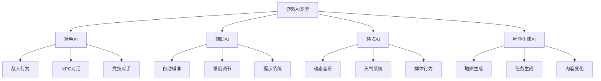

#### AI算法技术对比
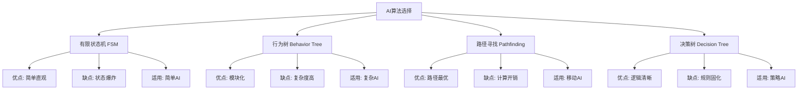

#### 贪吃蛇AI设计思路
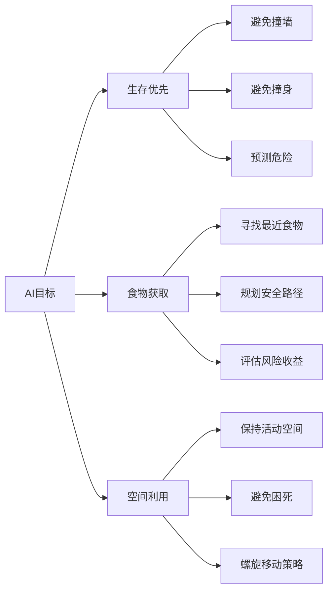

### 2. AI算法实现（15分钟）

#### 简单规则AI实现
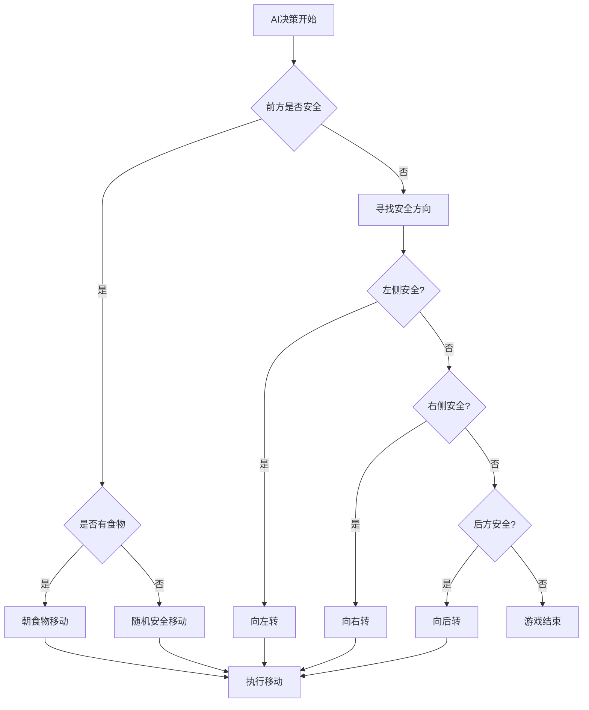

#### A*寻路算法在贪吃蛇中的应用
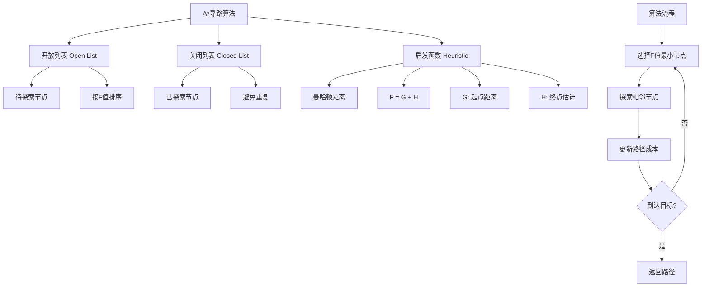

#### 避免死路的策略算法
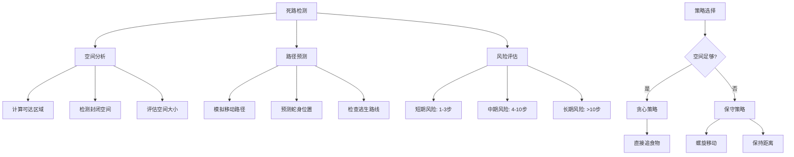

#### AI难度调节机制
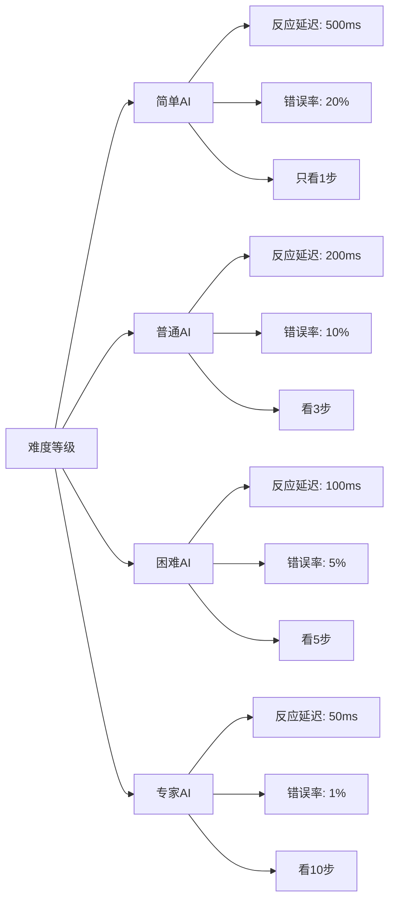

### 3. 人机交互优化（5分钟）

#### AI行为可预测性平衡
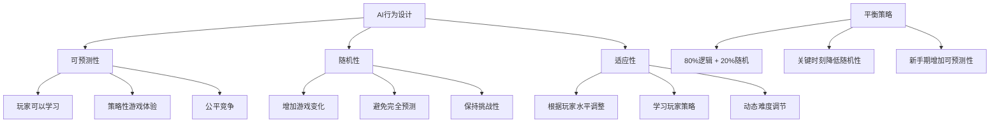

#### AI思考过程可视化
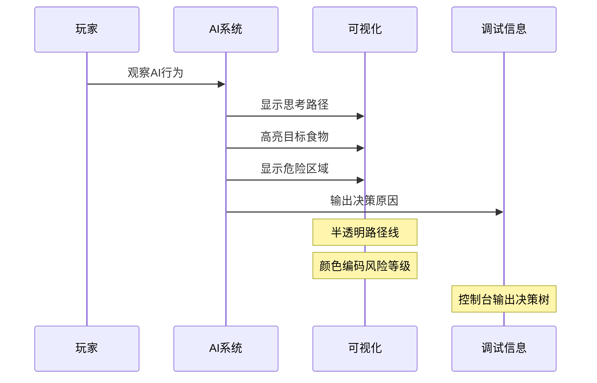

## 实践环节

### 1. AI系统架构
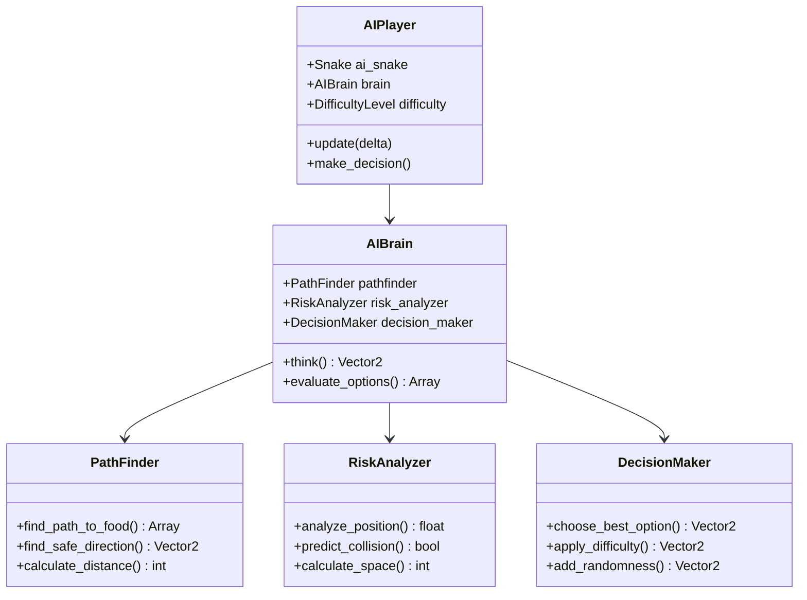

### 2. 核心AI脚本结构

#### AIPlayer.gd
```gdscript
extends Node2D
class_name AIPlayer

enum Difficulty { EASY, NORMAL, HARD, EXPERT }

var ai_snake: Snake
var brain: AIBrain
var difficulty: Difficulty = Difficulty.NORMAL
var reaction_delay: float = 0.2
var error_rate: float = 0.1

func _ready():
    setup_ai_snake()
    setup_brain()

func update_ai(delta: float):
    if should_make_decision():
        var decision = brain.think()
        ai_snake.change_direction(decision)

func should_make_decision() -> bool:
    # 根据难度调整反应速度
    pass
```

#### AIBrain.gd
```gdscript
extends Node
class_name AIBrain

var pathfinder: PathFinder
var risk_analyzer: RiskAnalyzer
var decision_maker: DecisionMaker

func think() -> Vector2:
    var options = evaluate_options()
    return decision_maker.choose_best_option(options)

func evaluate_options() -> Array:
    var directions = [Vector2.UP, Vector2.DOWN, Vector2.LEFT, Vector2.RIGHT]
    var evaluated_options = []
    
    for direction in directions:
        var option = {
            "direction": direction,
            "safety": risk_analyzer.analyze_direction(direction),
            "food_distance": pathfinder.distance_to_food(direction),
            "space_available": risk_analyzer.calculate_space(direction)
        }
        evaluated_options.append(option)
    
    return evaluated_options
```

### 3. 实现步骤

1. **创建基础AI框架**
   - 设计AI类层次结构
   - 实现基础决策逻辑
   - 添加调试输出

2. **实现寻路算法**
   - A*算法核心逻辑
   - 路径优化
   - 性能优化

3. **添加风险评估**
   - 碰撞预测
   - 空间分析
   - 死路检测

4. **调试和优化**
   - 可视化AI思考过程
   - 性能分析
   - 行为调优

## 技术要点

### 1. 算法优化
- 限制寻路搜索深度
- 使用启发式剪枝
- 缓存计算结果

### 2. 调试技巧
- 可视化AI决策过程
- 记录AI行为日志
- 分步调试算法

### 3. 性能考虑
- 避免每帧计算复杂AI
- 使用协程分帧处理
- 优化数据结构

## AI行为测试

### 1. 测试场景设计
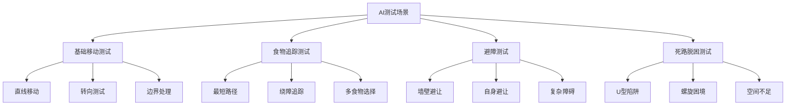

### 2. 性能指标
- **生存时间**：AI平均存活步数
- **食物效率**：单位时间获得食物数
- **空间利用率**：有效使用游戏区域比例
- **决策延迟**：AI反应时间统计

## 课时总结

本课时通过AI系统的实现，学生学会了：
1. 游戏AI的基本设计原理
2. 寻路算法的实际应用
3. AI行为的调试和优化方法
4. 人机交互体验的平衡设计

## 作业布置

1. 实现更复杂的AI策略（如群体行为）
2. 添加AI学习功能（记录玩家行为模式）
3. 设计AI vs AI的对战模式

## 下节课预告

下节课我们将实现多人游戏功能，学习网络编程基础，使用Golang搭建游戏服务器，实现实时对战功能。