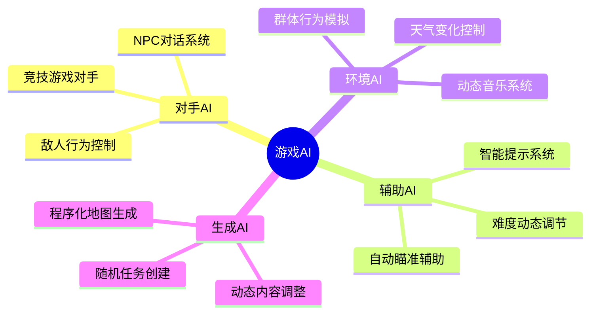
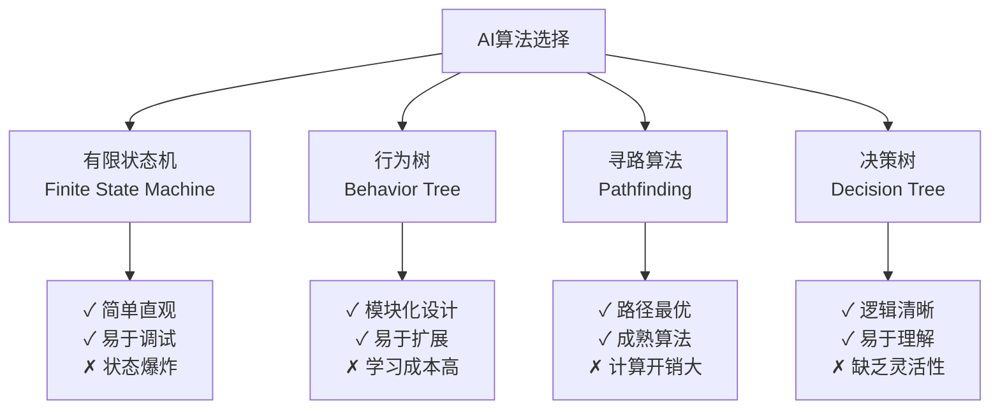
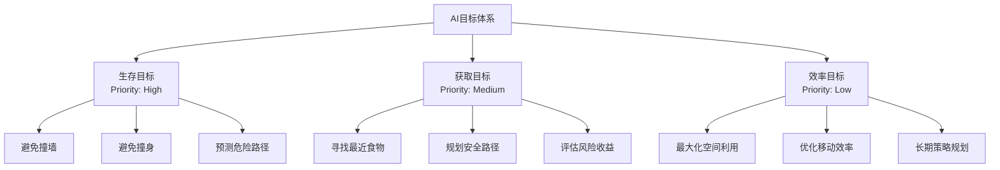
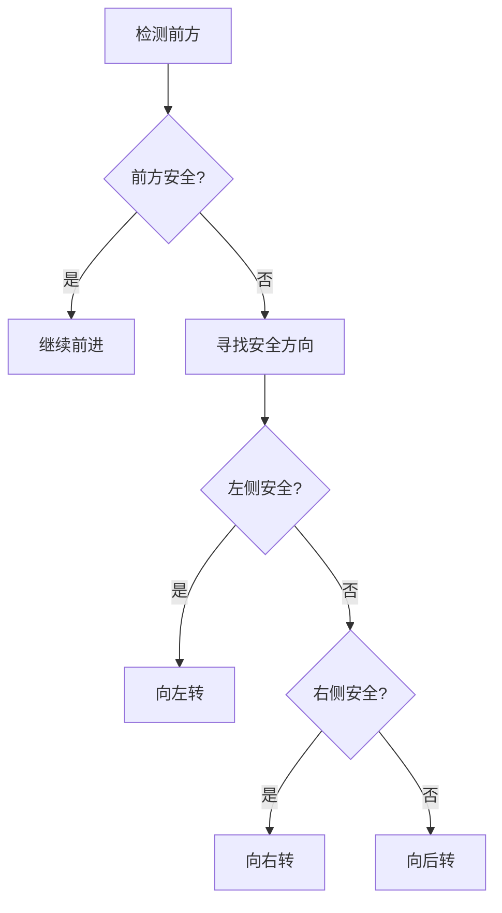
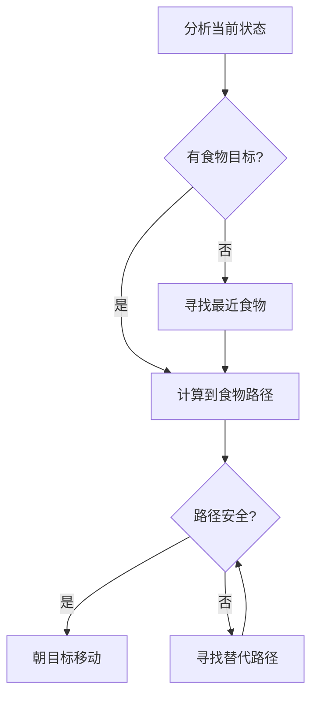
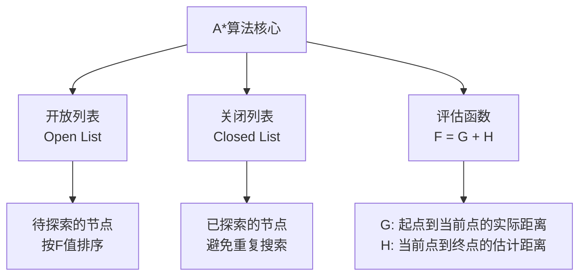
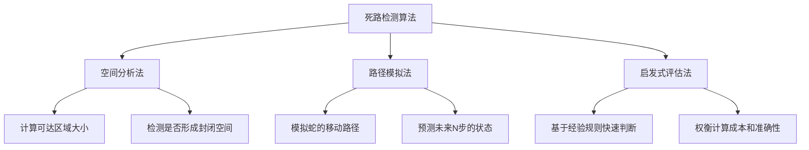
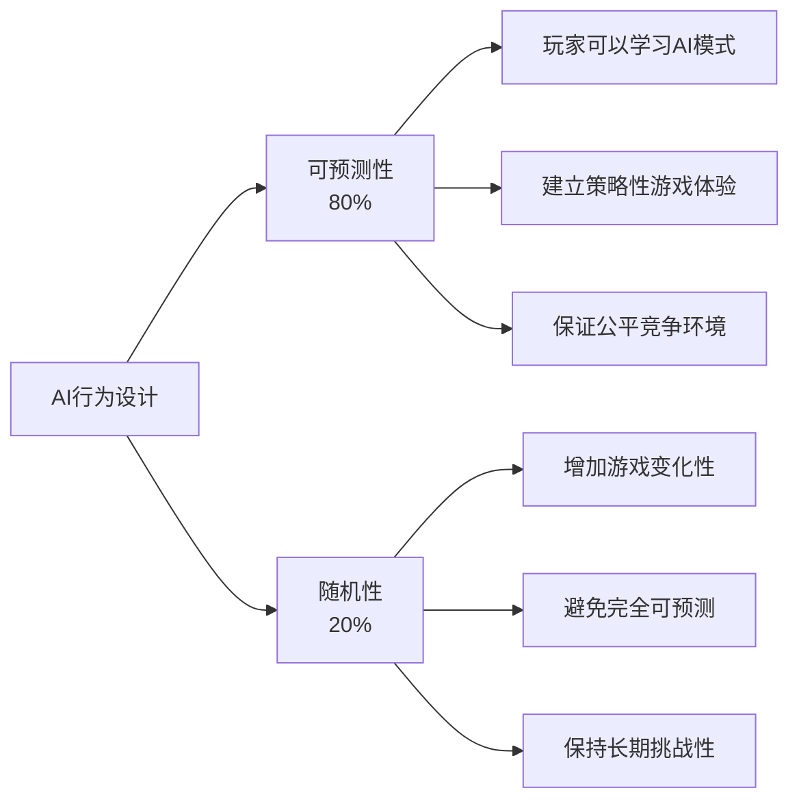
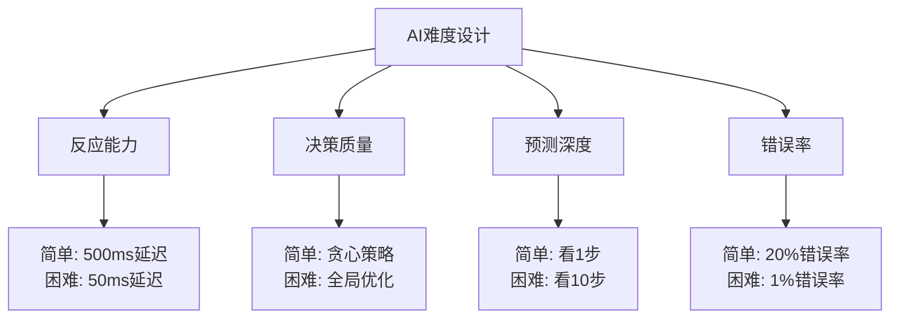
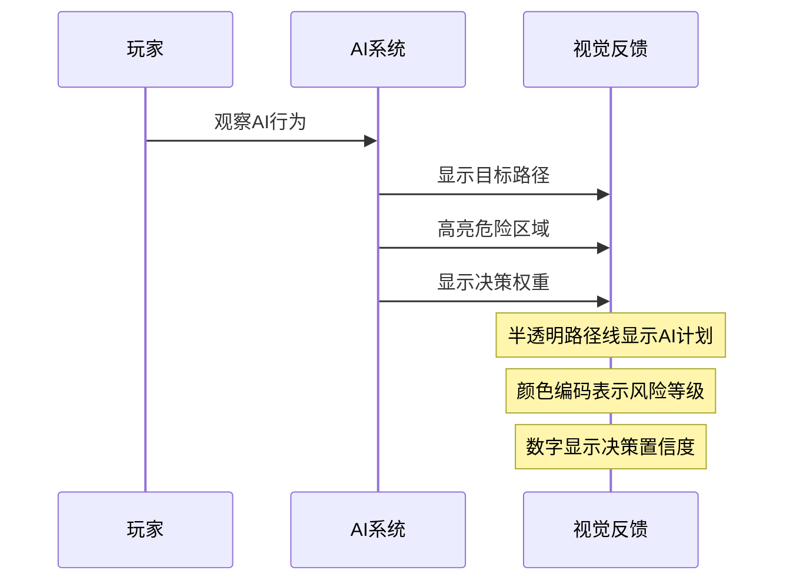

# 课时3：游戏AI与智能化

## 课时目标（5分钟）
通过本课时学习，学生将能够：
- 理解游戏AI的基本概念、分类和应用场景
- 掌握AI决策算法的设计思路和实现方法
- 学会寻路算法在游戏中的实际应用
- 理解AI行为设计中的平衡性和用户体验考虑

## 教学内容

### 1. 游戏AI的世界观（10分钟）

#### 什么是游戏AI？
游戏AI不同于学术AI，它的目标不是"最聪明"，而是"最有趣"：
- **娱乐性优先**：AI的行为要能增强游戏体验
- **可预测性**：玩家需要能够学习和适应AI的行为模式
- **挑战性**：提供合适的难度，既不太简单也不太困难
- **表现力**：AI的行为要能传达"智能"的感觉

#### 游戏AI的分类和作用


**在贪吃蛇中的应用**：
- **对手AI**：电脑控制的蛇，与玩家竞争
- **辅助AI**：智能难度调节，保持游戏挑战性
- **生成AI**：智能食物放置，避免过于简单或困难的局面

#### AI算法的选择哲学
不同的AI算法适用于不同的场景：



**选择原则**：
- **问题匹配**：算法要适合具体的游戏场景
- **性能考虑**：实时游戏对性能要求很高
- **开发效率**：团队的技术水平和开发时间
- **可维护性**：后续调整和扩展的便利性

### 2. 贪吃蛇AI的设计与实现（15分钟）

#### AI的目标层次设计
一个好的贪吃蛇AI需要平衡多个目标：



**目标冲突的处理**：
- 当生存和获取目标冲突时，优先选择生存
- 当短期和长期目标冲突时，需要权衡评估
- 引入随机性避免AI行为过于机械化

#### 从简单规则到复杂决策
让我们从最简单的AI开始，逐步增加复杂性：

**第一层：反应式AI**


**第二层：目标导向AI**


**第三层：预测式AI**
- 模拟未来几步的移动结果
- 评估每个选择的长期后果
- 考虑空间利用和逃生路线

#### A*寻路算法的游戏应用
A*算法是游戏中最常用的寻路算法：



**在贪吃蛇中的特殊考虑**：
- **动态障碍**：蛇身是移动的障碍物
- **时间因素**：需要预测蛇身未来的位置
- **多目标**：可能同时存在多个食物
- **安全性**：路径不仅要最短，还要安全

#### 死路检测与避免策略
这是贪吃蛇AI最关键的技术：



**实用策略**：
- **螺旋移动**：在空旷区域保持螺旋路径
- **边界跟随**：沿着边界移动保持逃生路线
- **空间预留**：避免将自己困在狭小空间

### 3. AI行为的人性化设计（5分钟）

#### 可预测性与随机性的平衡
好的游戏AI需要在可预测性和随机性之间找到平衡：



**实现技巧**：
- **关键时刻降低随机性**：在生死攸关的时候，AI应该更理性
- **新手友好**：对新玩家增加AI的可预测性
- **适应性调整**：根据玩家水平动态调整AI行为

#### 难度调节的艺术
AI难度不应该只是"反应速度"的差别：



#### AI思考过程的可视化
让玩家看到AI的"思考"过程可以增强游戏体验：



## 实践环节（5分钟）

### 编程实践：AI决策逻辑
学生将实现一个简单但有效的AI决策系统：

```gdscript
# 简单的AI决策逻辑
func make_decision() -> Vector2:
    var options = get_possible_directions()
    var best_option = Vector2.ZERO
    var best_score = -999999
    
    for direction in options:
        var score = evaluate_direction(direction)
        if score > best_score:
            best_score = score
            best_option = direction
    
    return best_option

func evaluate_direction(direction: Vector2) -> float:
    var score = 0.0
    
    # 安全性评分（最重要）
    if is_safe_direction(direction):
        score += 1000
    else:
        return -999999  # 不安全的方向直接排除
    
    # 食物距离评分
    var food_distance = get_distance_to_food(direction)
    score += 100.0 / (food_distance + 1)
    
    # 空间利用评分
    var space_available = calculate_available_space(direction)
    score += space_available * 10
    
    return score
```

### 调试和测试技巧
- **可视化调试**：在屏幕上显示AI的决策过程
- **性能监控**：监控AI计算的耗时
- **行为日志**：记录AI的决策历史用于分析

## 课时总结（2分钟）

通过本课时的学习，学生理解了：

1. **AI设计哲学**：游戏AI的目标是娱乐性而非最优性
2. **算法应用**：如何将经典算法应用到具体游戏场景
3. **行为设计**：AI行为的人性化和用户体验考虑
4. **实现技巧**：从简单规则到复杂决策的渐进式开发

**关键收获**：
- 游戏AI不是越聪明越好，而是要符合游戏设计目标
- 算法选择要考虑性能、可维护性和开发效率
- AI行为设计需要平衡挑战性和可玩性

## 课后思考

1. **创新挑战**：设计一个具有"个性"的AI，让它有独特的游戏风格
2. **算法优化**：思考如何优化A*算法在贪吃蛇中的性能
3. **行为分析**：观察其他游戏中的AI设计，分析其优缺点

## 下节课预告

下节课我们将进入网络编程的世界，学习如何实现多人实时对战功能。我们将使用Golang搭建游戏服务器，实现WebSocket通信，让多个玩家能够在同一个游戏世界中竞争。这将把我们的单机游戏提升到全新的层次。