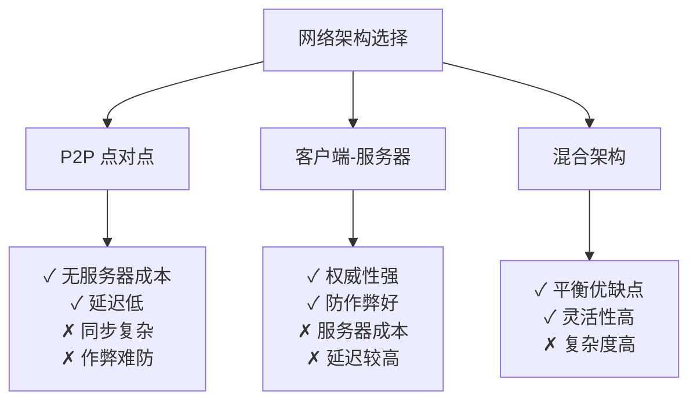
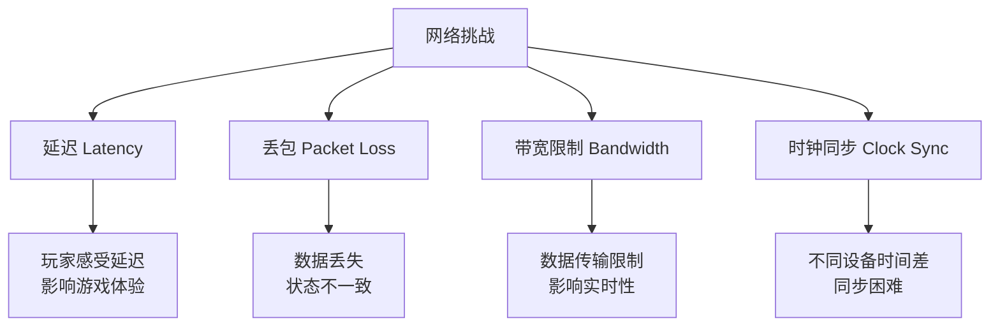
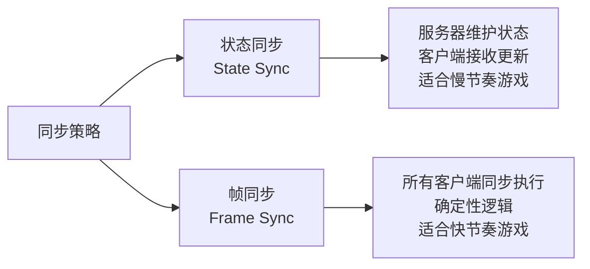
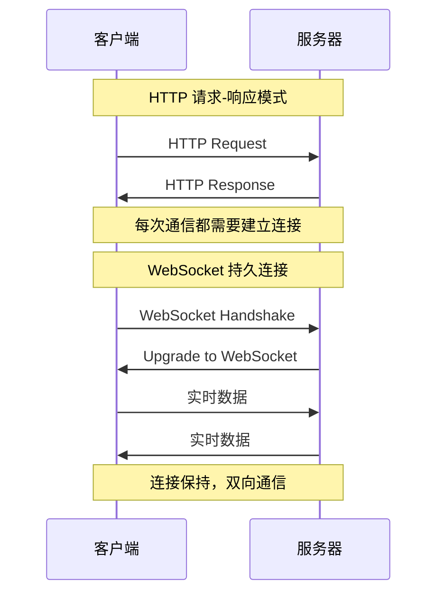
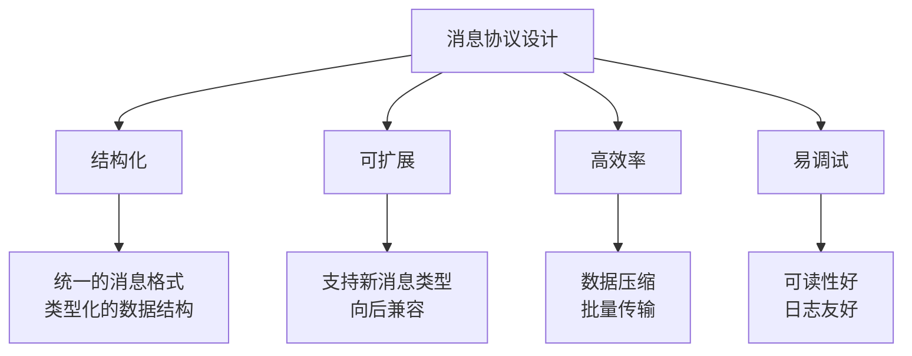
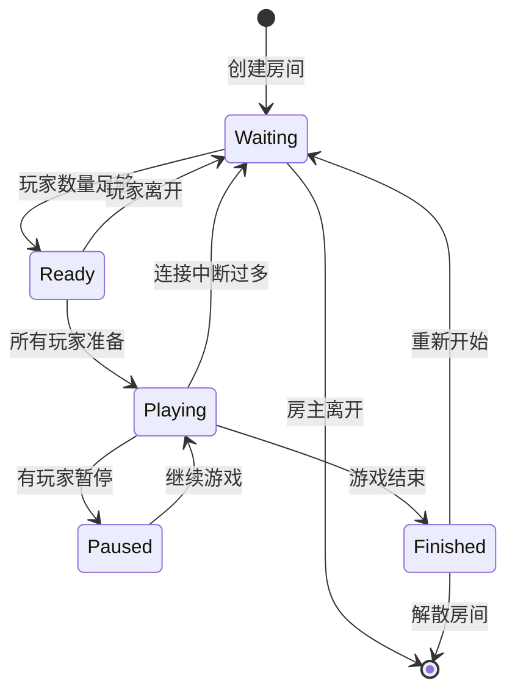
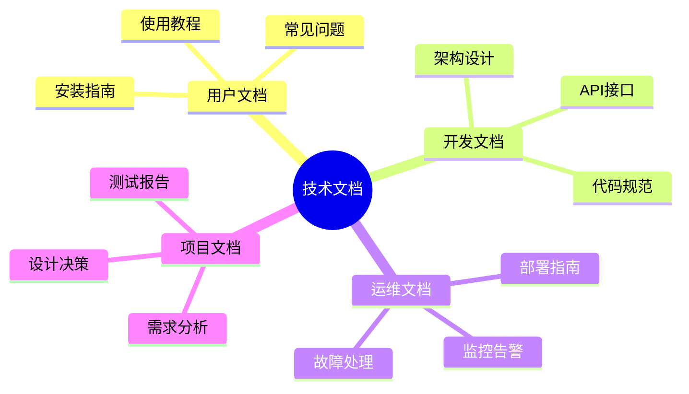
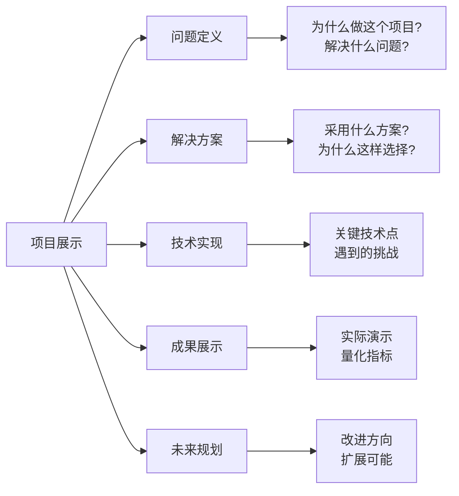
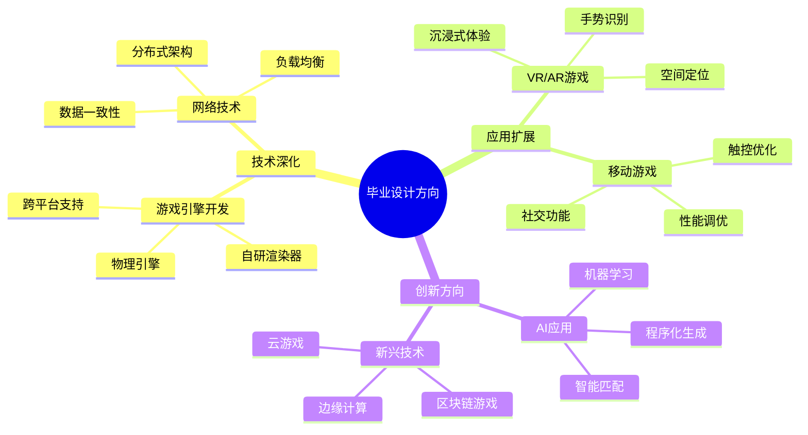

# 课时4：多人游戏与项目总结

## 课时目标（5分钟）
通过本课时学习，学生将能够：
- 理解网络游戏的基本架构和设计原理
- 掌握实时通信技术的应用和实现方法
- 学会项目总结和技术文档的编写规范
- 建立完整的游戏开发知识体系和未来学习方向

## 教学内容

### 1. 网络游戏的架构世界（12分钟）

#### 为什么需要网络游戏？
网络游戏不仅仅是技术的展示，更是现代游戏发展的必然趋势：
- **社交需求**：玩家希望与朋友一起游戏
- **竞技体验**：与真人对战比AI更有挑战性
- **内容扩展**：网络可以提供持续更新的内容
- **商业价值**：网络游戏有更好的商业模式

#### 网络架构的选择哲学
不同的网络架构适用于不同的游戏类型：



**贪吃蛇的选择**：客户端-服务器架构
- **权威性**：服务器决定游戏状态，防止作弊
- **简单性**：架构清晰，易于理解和实现
- **扩展性**：支持观战、排行榜等功能

#### 实时同步的技术挑战
网络游戏最大的挑战是如何在不稳定的网络环境下保持游戏的流畅性：



**解决策略**：
- **客户端预测**：本地立即响应，后续校正
- **服务器权威**：服务器最终决定游戏状态
- **插值平滑**：平滑处理网络抖动
- **状态压缩**：减少网络传输数据量

#### 同步策略的深度对比


**贪吃蛇的选择**：状态同步
- **游戏节奏**：贪吃蛇相对较慢，状态同步足够
- **实现简单**：状态同步更容易理解和实现
- **调试友好**：状态可视化，便于调试

### 2. WebSocket实时通信技术（10分钟）

#### 为什么选择WebSocket？
相比传统的HTTP请求，WebSocket有明显优势：



**WebSocket的优势**：
- **实时性**：双向实时通信，无需轮询
- **效率高**：连接复用，减少握手开销
- **简单性**：API简单，易于使用
- **兼容性**：现代浏览器和游戏引擎都支持

#### 消息协议的设计艺术
一个好的消息协议应该是：



**我们的消息格式**：
```json
{
    "type": "PLAYER_INPUT",
    "data": {
        "direction": {"x": 1, "y": 0},
        "timestamp": 1642345678
    },
    "sequence": 12345
}
```

#### 房间系统的状态管理
房间是多人游戏的核心概念：



**状态转换的考虑**：
- **玩家体验**：状态转换要符合玩家预期
- **异常处理**：网络断线、玩家离开等异常情况
- **公平性**：确保所有玩家在相同条件下游戏

### 3. 从项目到产品：总结与展望（8分钟）

#### 技术文档的重要性
好的技术文档是项目成功的关键：



**文档编写原则**：
- **受众导向**：针对不同读者编写不同文档
- **结构清晰**：逻辑层次分明，易于查找
- **实例丰富**：提供具体的代码示例
- **持续更新**：随着项目发展及时更新

#### 项目展示的艺术
一个好的项目展示应该包含：



**展示技巧**：
- **故事化**：用故事线串联整个项目
- **可视化**：用图表和演示增强说服力
- **互动性**：让观众参与体验
- **诚实性**：承认不足，展示学习过程

#### 毕业设计的选题思路
基于这个项目，学生可以向多个方向深化：



## 实践环节（5分钟）

### 网络编程实践
学生将实现一个简单的WebSocket通信：

```gdscript
# 客户端网络管理器
extends Node
class_name NetworkManager

var socket: WebSocketPeer
var is_connected: bool = false

func connect_to_server(url: String):
    socket = WebSocketPeer.new()
    var error = socket.connect_to_url(url)
    if error == OK:
        print("正在连接服务器...")
    else:
        print("连接失败: ", error)

func send_player_input(direction: Vector2):
    if is_connected:
        var message = {
            "type": "PLAYER_INPUT",
            "data": {"direction": {"x": direction.x, "y": direction.y}},
            "timestamp": Time.get_unix_time_from_system()
        }
        socket.send_text(JSON.stringify(message))

func _process(delta):
    if socket:
        socket.poll()
        var state = socket.get_ready_state()
        
        if state == WebSocketPeer.STATE_OPEN and not is_connected:
            is_connected = true
            print("已连接到服务器")
        elif state == WebSocketPeer.STATE_CLOSED and is_connected:
            is_connected = false
            print("与服务器断开连接")
        
        while socket.get_available_packet_count():
            var packet = socket.get_packet()
            handle_server_message(packet.get_string_from_utf8())

func handle_server_message(message: String):
    var data = JSON.parse_string(message)
    match data.type:
        "GAME_STATE":
            update_game_state(data.data)
        "PLAYER_JOINED":
            on_player_joined(data.data)
        "GAME_OVER":
            on_game_over(data.data)
```

### 项目总结练习
学生需要完成一份项目总结报告，包括：
1. **技术选型的理由和权衡**
2. **遇到的主要技术挑战**
3. **解决问题的思路和方法**
4. **项目的收获和不足**
5. **未来的改进方向**

## 课时总结（2分钟）

通过这4个课时的完整学习，学生建立了：

1. **系统性思维**：从需求分析到架构设计的完整流程
2. **技术实践能力**：掌握了游戏开发的核心技术
3. **问题解决能力**：学会了分析问题和寻找解决方案
4. **项目管理意识**：理解了文档、测试、部署的重要性

**核心收获**：
- **游戏开发不是孤立的编程**，而是系统工程
- **技术选择要基于实际需求**，而不是追求新潮
- **用户体验是技术实现的最终目标**
- **持续学习是技术发展的必然要求**

## 未来学习路径

### 短期目标（1-3个月）
1. **深化现有技术**：优化当前项目的性能和功能
2. **扩展技术栈**：学习相关的工具和框架
3. **参与开源项目**：为开源游戏项目贡献代码

### 中期目标（3-12个月）
1. **专业化发展**：选择一个方向深入研究
2. **项目作品集**：完成2-3个有质量的项目
3. **技术分享**：写技术博客，参加技术会议

### 长期目标（1-3年）
1. **行业专家**：在某个领域成为专家
2. **团队协作**：参与或领导团队项目
3. **创新突破**：在技术或产品上有所创新

## 结语

游戏开发是一个充满创造力和挑战性的领域。通过这个贪吃蛇项目，我们不仅学会了具体的技术，更重要的是建立了正确的学习方法和思维模式。

记住：**最好的学习方式就是动手实践**。继续编码，继续创造，游戏开发的世界等待着你们的探索！