# 课时4：多人游戏与项目总结

## 课时目标
- 理解网络游戏的基本架构
- 掌握WebSocket实时通信技术
- 实现简单的多人对战功能
- 学会项目文档编写和总结

## 教学内容

### 1. 网络游戏架构（12分钟）

#### 客户端-服务器模型对比
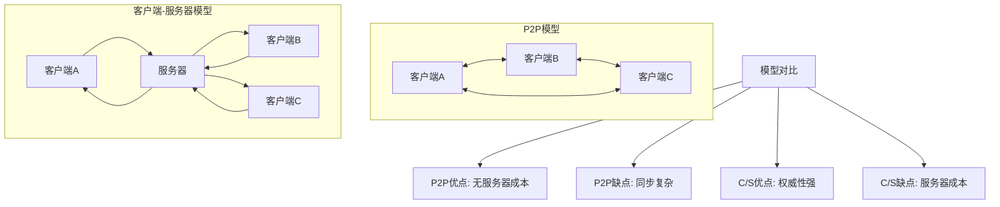

#### 实时同步策略对比
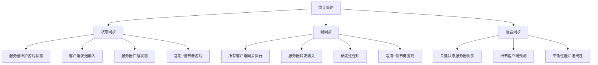

#### 网络延迟处理技术
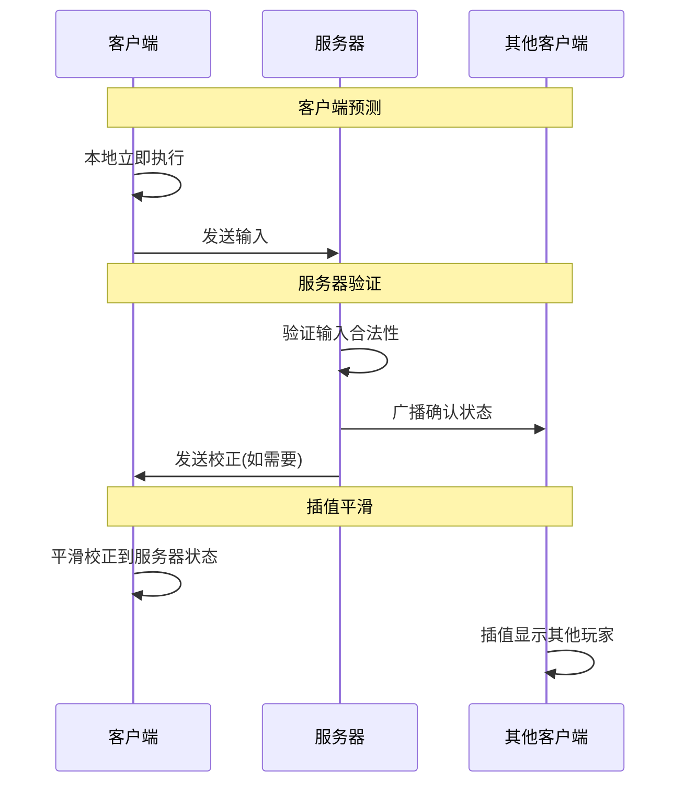

#### Golang后端服务设计
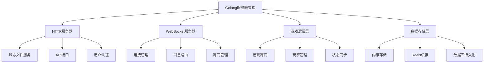

### 2. 多人功能实现（10分钟）

#### WebSocket通信协议设计
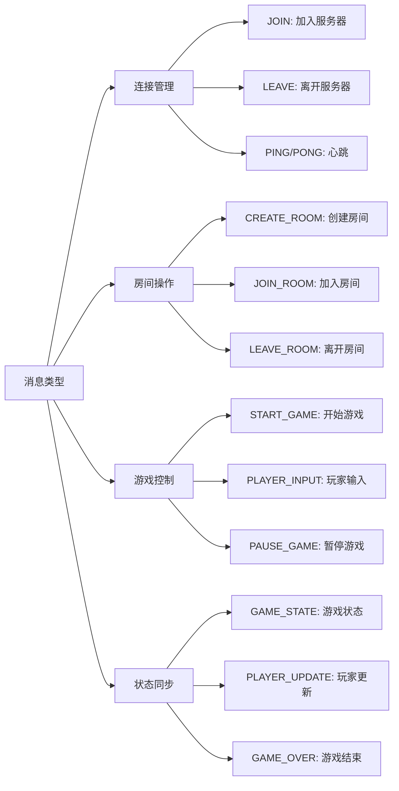

#### 房间系统设计
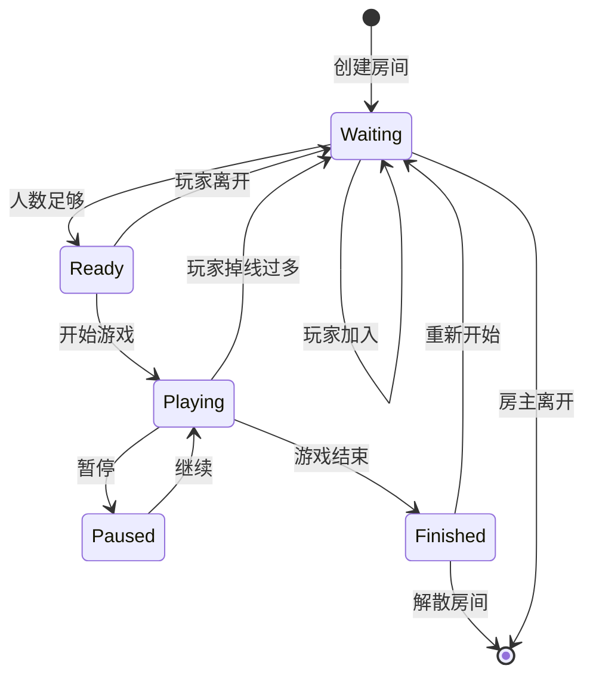

#### 玩家匹配机制
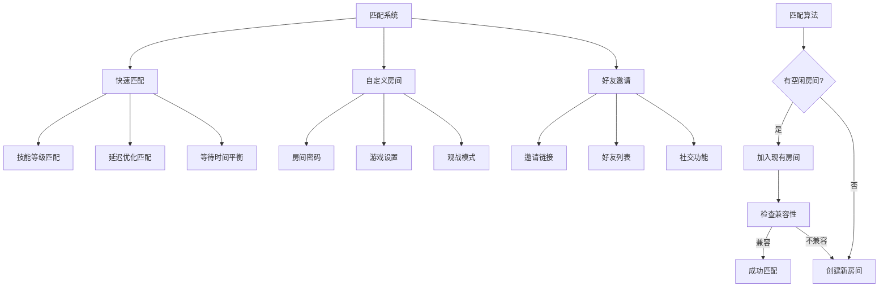

#### 数据一致性保证
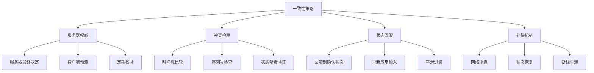

### 3. 项目总结与文档（8分钟）

#### 技术文档编写规范
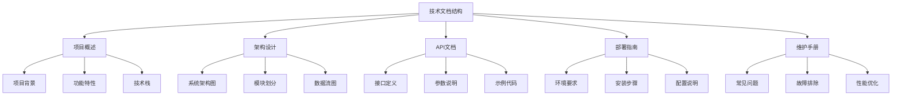

#### 项目展示技巧
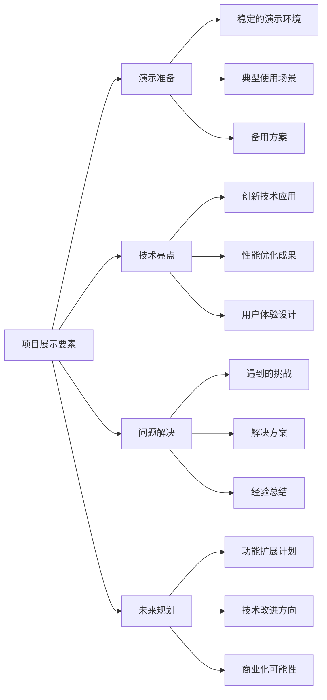

#### 毕业设计选题建议
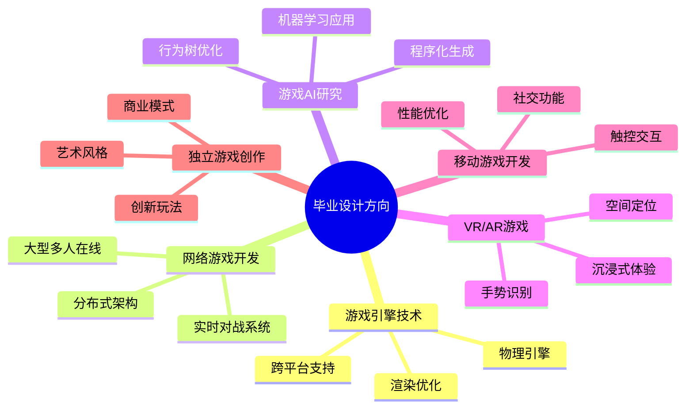

## 实践环节

### 1. 服务器架构实现

#### 项目结构
```
server/
├── main.go              # 主程序入口
├── config/              # 配置管理
│   └── config.go
├── handlers/            # HTTP处理器
│   ├── websocket.go     # WebSocket处理
│   └── api.go          # REST API
├── game/               # 游戏逻辑
│   ├── room.go         # 房间管理
│   ├── player.go       # 玩家管理
│   └── snake.go        # 游戏逻辑
├── models/             # 数据模型
│   ├── message.go      # 消息定义
│   └── game_state.go   # 游戏状态
└── utils/              # 工具函数
    ├── logger.go       # 日志工具
    └── validator.go    # 数据验证
```

#### 核心服务器代码结构

##### main.go
```go
package main

import (
    "log"
    "net/http"
    "github.com/gorilla/websocket"
    "github.com/gorilla/mux"
)

type Server struct {
    rooms    map[string]*Room
    upgrader websocket.Upgrader
}

func main() {
    server := NewServer()
    
    r := mux.NewRouter()
    r.HandleFunc("/ws", server.handleWebSocket)
    r.PathPrefix("/").Handler(http.FileServer(http.Dir("./static/")))
    
    log.Println("Server starting on :8080")
    log.Fatal(http.ListenAndServe(":8080", r))
}
```

##### room.go
```go
type Room struct {
    ID       string
    Players  map[string]*Player
    GameState *GameState
    Broadcast chan []byte
    Register  chan *Player
    Unregister chan *Player
}

func (r *Room) Run() {
    for {
        select {
        case player := <-r.Register:
            r.addPlayer(player)
        case player := <-r.Unregister:
            r.removePlayer(player)
        case message := <-r.Broadcast:
            r.broadcastMessage(message)
        }
    }
}
```

### 2. 客户端网络层实现

#### NetworkManager.gd
```gdscript
extends Node
class_name NetworkManager

signal connected_to_server
signal disconnected_from_server
signal room_joined(room_id)
signal game_state_updated(state)

var socket: WebSocketPeer
var server_url: String = "ws://localhost:8080/ws"

func connect_to_server():
    socket = WebSocketPeer.new()
    var error = socket.connect_to_url(server_url)
    if error != OK:
        print("Failed to connect to server")

func send_message(type: String, data: Dictionary):
    var message = {
        "type": type,
        "data": data,
        "timestamp": Time.get_unix_time_from_system()
    }
    socket.send_text(JSON.stringify(message))

func _process(delta):
    if socket:
        socket.poll()
        var state = socket.get_ready_state()
        
        if state == WebSocketPeer.STATE_OPEN:
            while socket.get_available_packet_count():
                var packet = socket.get_packet()
                handle_message(packet.get_string_from_utf8())
```

### 3. 实现步骤

1. **搭建基础服务器**
   - 创建HTTP服务器
   - 实现WebSocket升级
   - 添加基础路由

2. **实现房间系统**
   - 房间创建和管理
   - 玩家加入和离开
   - 消息广播机制

3. **添加游戏同步**
   - 状态同步逻辑
   - 输入验证
   - 冲突解决

4. **客户端集成**
   - 网络层封装
   - UI界面更新
   - 错误处理

## 技术要点

### 1. 性能优化
- 连接池管理
- 消息批处理
- 内存复用

### 2. 安全考虑
- 输入验证
- 频率限制
- 防作弊机制

### 3. 错误处理
- 网络断线重连
- 状态恢复
- 优雅降级

## 项目文档模板

### 1. README.md 结构
```markdown
# 贪吃蛇多人对战游戏

## 项目简介
基于Godot 4.4和Golang开发的实时多人贪吃蛇游戏

## 功能特性
- 单人游戏模式
- AI对手挑战
- 多人实时对战
- 排行榜系统

## 技术架构
- 前端：Godot 4.4 + GDScript
- 后端：Golang 1.22 + WebSocket
- 通信：JSON消息协议

## 快速开始
### 环境要求
### 安装步骤
### 运行说明

## API文档
### WebSocket消息格式
### 游戏状态同步

## 开发指南
### 项目结构
### 开发规范
### 测试方法

## 部署说明
### 服务器部署
### 客户端打包
### 配置管理
```

### 2. 技术总结报告
- **项目背景和目标**
- **技术选型和理由**
- **架构设计和实现**
- **关键技术难点**
- **性能优化措施**
- **测试和验证**
- **项目成果和收获**
- **未来改进方向**

## 课时总结

本课时通过多人游戏功能的实现，学生掌握了：
1. 网络游戏的基本架构设计
2. 实时通信技术的应用
3. 分布式系统的基础概念
4. 项目文档的编写规范

## 毕业设计建议

### 1. 技术深化方向
- **游戏引擎开发**：自研2D/3D引擎
- **大型多人游戏**：MMO架构设计
- **AI算法研究**：深度学习在游戏中的应用
- **跨平台技术**：一套代码多端运行

### 2. 创新应用方向
- **VR/AR游戏**：沉浸式游戏体验
- **区块链游戏**：去中心化游戏经济
- **云游戏技术**：流媒体游戏服务
- **教育游戏**：寓教于乐的学习平台

### 3. 商业化方向
- **独立游戏开发**：创意驱动的小团队开发
- **游戏工具开发**：为其他开发者提供工具
- **技术服务**：游戏开发外包服务
- **平台运营**：游戏发布和运营平台

## 持续学习路径

1. **深入学习游戏引擎源码**
2. **关注游戏行业技术趋势**
3. **参与开源游戏项目**
4. **建立个人技术博客**
5. **参加游戏开发竞赛**

通过这4个课时的学习，学生不仅掌握了具体的技术技能，更重要的是建立了完整的游戏开发思维框架，为未来的专业发展奠定了坚实基础。